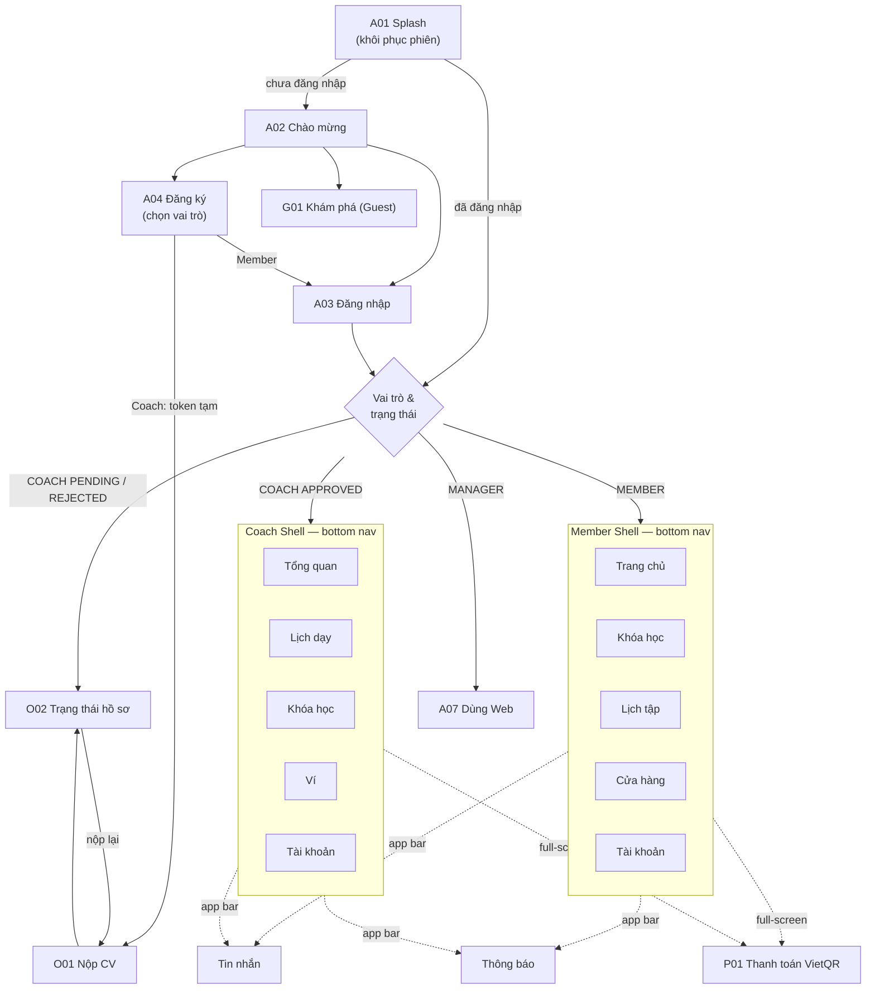

# 📱 Kế hoạch xây dựng giao diện Mobile App (UI-only, mock data)

> **Phạm vi:** chỉ dựng giao diện Flutter cho Mobile, dữ liệu giả lập (mock) qua lớp service/repository. **Chưa nối API.** Không sửa/không thêm việc cho Web (`FE/` chỉ để tham khảo giao diện).
> **Trạng thái:** 🟢 ĐÃ DUYỆT (08/10/2026) — đang thực hiện Giai đoạn 3 theo lộ trình mục 9. Không commit/push.
> **Tiến độ (cập nhật 08/10/2026):** Phase 0–11 và 13 **xong**; Phase 12 còn 12.1 (rà a11y thủ công), 12.2 (chạy thử trên thiết bị Android/iOS). 12.3 xong (tách file lớn + rà trùng lặp). `flutter analyze` 0 issue · `flutter test` 63/63 pass. Chi tiết lệch kế hoạch ở mục 11.
> **Ngày lập:** 08/10/2026. **Nhánh:** `develop` (commit `a0484b6`).
> **Nguồn đã khảo sát:** `Doc/PROJECT_OVERVIEW.md`, `README.md`, `Mobile/README.md`, `Mobile/*` (pubspec, gradle, lib), `FE/` (src + docs), `BE/prisma/schema.prisma`, `BE/src/modules/*/{routes,schema,service}`.

> Ghi chú: thư mục tài liệu trong repo là `Doc/` (không phải `DOC/`). Windows không phân biệt hoa thường nên file được lưu tại `Doc/MOBILE_UI_PLAN.md`.

---

## Mục lục

0. [Quyết định đã chốt](#0-quyết-định-đã-chốt)
1. [Tóm tắt dự án và nghiệp vụ](#1-tóm-tắt-dự-án-và-nghiệp-vụ)
2. [Công nghệ Mobile hiện tại và thư viện đề xuất](#2-công-nghệ-mobile-hiện-tại-và-thư-viện-đề-xuất)
3. [Design system cho Mobile](#3-design-system-cho-mobile)
4. [Cấu trúc thư mục đề xuất](#4-cấu-trúc-thư-mục-đề-xuất)
5. [Navigation, phân luồng theo vai trò và danh sách màn hình](#5-navigation-phân-luồng-theo-vai-trò-và-danh-sách-màn-hình)
6. [Đối chiếu sai lệch FE ↔ Nghiệp vụ ↔ BE](#6-đối-chiếu-sai-lệch-fe--nghiệp-vụ--be)
7. [Component dùng chung](#7-component-dùng-chung)
8. [Chiến lược mock data](#8-chiến-lược-mock-data)
9. [Lộ trình thực hiện](#9-lộ-trình-thực-hiện)
10. [Rủi ro, giả định và câu hỏi cần xác nhận](#10-rủi-ro-giả-định-và-câu-hỏi-cần-xác-nhận)
11. [Thay đổi so với kế hoạch](#11-thay-đổi-so-với-kế-hoạch)

---

## 0. Quyết định đã chốt

> Chốt ngày 08/10/2026 theo trả lời của chủ dự án Mobile. **Bối cảnh:** người phụ trách chỉ làm Flutter Mobile. Mọi chức năng người dùng cần, Mobile phải tự đáp ứng, không chuyển hướng sang Web (trừ quản trị nặng). Chỗ nào phụ thuộc BE thì mock theo BE hiện tại và ghi **TODO BE** (mục 0.2). Các quyết định này **thay thế** "Đề xuất mặc định" ở mục 10.3 khi có khác biệt.

### 0.1. Quyết định

| # | Chủ đề | Quyết định | Ảnh hưởng lộ trình |
|---|---|---|---|
| Q1 | Manager trên Mobile | **CÓ, bản rút gọn:** duyệt CV HLV, duyệt khóa học, duyệt lệnh rút tiền, duyệt yêu cầu hoàn tiền. Mỗi mục có danh sách + chi tiết + nút **Duyệt / Từ chối** (từ chối **bắt buộc nhập lý do**). Các chức năng quản trị khác: mục "Vui lòng dùng Web". | Thêm **Phase 13** (ưu tiên thấp nhất, làm cuối). A07 thành "Manager Shell" |
| Q2 | Guest xem khóa học | **CÓ**, xem danh sách + chi tiết; bấm Mua/Thanh toán ⇒ yêu cầu đăng nhập. | Phase 5. TODO BE-1 |
| Q3 | Member hủy/đổi từng buổi | **CÓ**, cả **hủy buổi** và **đổi buổi** (sang buổi khác cùng khóa), theo điều kiện BE: chỉ chỗ `BOOKED`, buổi **chưa bắt đầu**; buổi đích cùng khóa, `SCHEDULED`, chưa bắt đầu, còn chỗ. Không được phép ⇒ **disable nút + hiển thị lý do**. | Phase 6 thêm task 6.5 (M16, M17) |
| Q4 | Coach tạo khóa học | **CÓ**, wizard 3 bước, cuối Phase 9. | Giữ |
| Q5 | Duyệt khóa học | **ĐÚNG.** Hiển thị Chờ duyệt / Đã duyệt / Bị từ chối (**kèm lý do**). Coach được **sửa và gửi lại** khóa bị từ chối. | Phase 9 thêm 9.5. TODO BE-2, BE-3 |
| Q6 | Feedback | **Cả hai góc nhìn:** Member chấm điểm HLV + mục **"Nhận xét của HLV"** trong lộ trình của Member. | Giữ |
| Q7 | Chat phòng chung | **KHÔNG**, chỉ 1-1; component chat thiết kế tổng quát (hội thoại có danh sách thành viên) để mở rộng nhóm sau. | Giữ |
| Q8 | Đặt lại mật khẩu | Làm trong app: A05 nhập email ⇒ A06 **nhập mã OTP 6 số** + mật khẩu mới. Deep link từ email để giai đoạn sau. | TODO BE-4 |
| Q9 | Dark mode | **CHƯA làm**; token tách riêng (`ThemeExtension`) để thêm sau. | Bỏ U03 |
| Q10 | Điều kiện rút tiền | Mock theo **BE** (toàn bộ khóa của HLV phải `COMPLETED` + không có lệnh rút đang chờ + đủ số dư khả dụng). UI hiển thị **lý do không đủ điều kiện lấy từ dữ liệu** (danh sách `blockers` do repository trả về), không hard-code. Mâu thuẫn tài liệu ↔ BE ghi ở mục 10.1 để chốt với BA/BE. | TODO BE-5 |
| Q11 | Màn VietQR | **CÓ** ngay giai đoạn này: **Lưu ảnh QR** vào thư viện ảnh, **Chia sẻ**, sao chép số tài khoản / số tiền / nội dung CK. "Mở app ngân hàng" để giai đoạn sau. | Phase 5, thêm package `gal`, `share_plus` |
| Q12 | Ảnh & hóa đơn | Ảnh **placeholder** qua widget xử lý thiếu/lỗi ảnh (`AppNetworkImage`). Hóa đơn là **màn chi tiết trong app**, không xuất PDF. | TODO BE-6 |
| Q13 | Thương hiệu | **Giữ "pulse. SPORTS CENTER"** + icon Activity (splash, logo, header). | Phase 1 |
| Q14 | Bộ icon | **Lucide** (`lucide_icons_flutter`), bọc qua lớp **`AppIcons`** — màn hình chỉ dùng `AppIcons.xxx`. | Phase 1 |

### 0.2. TODO cho Backend (phát sinh từ quyết định & mock)

| Mã | Nội dung | Liên quan |
|---|---|---|
| BE-1 | Mở `GET /classes`, `GET /classes/:id`, `GET /classes/:id/course-plan` cho Guest (không bắt buộc token, chỉ trả khóa `APPROVED`). | Q2, D16 |
| BE-2 | Lưu **lý do từ chối khóa học** (Class hiện không có cột `rejectReason`; lý do chỉ nằm trong notification). | Q5 |
| BE-3 | Cho Coach **sửa & gửi lại** khóa `REJECTED` (⇒ `PENDING`); hiện `PATCH /classes/:id` chỉ cho MANAGER và service chỉ cho sửa `PENDING`. | Q5, D20 |
| BE-4 | Quên mật khẩu: gửi **OTP 6 số** qua email (TTL ~15 phút, giới hạn lần nhập sai); `PATCH /auth/reset-password` nhận `{ email, otp, newPassword }` thay vì token JWT trong link `localhost:3000`. | Q8 |
| BE-5 | Thống nhất điều kiện rút tiền (theo từng khóa như tài liệu hay toàn bộ khóa như code); trả kèm danh sách điều kiện chưa đạt (vd `GET /coaches/me/wallet` trả `withdrawEligibility`). | Q10, D9 |
| BE-6 | Bổ sung `imageUrl` cho Product (và tùy chọn cho Class); endpoint đọc hóa đơn sản phẩm của Coach (Invoice `memberId = null`). | Q12, D19, D21 |
| BE-7 | Manager: endpoint **liệt kê lệnh rút tiền** (`GET /coaches/wallet/transactions?type=WITHDRAWAL&status=PENDING`) — hiện chỉ có `PATCH .../review`. | Q1 |
| BE-8 | Manager: endpoint tải/xem file CV có xác thực (URL file CV trong `GET /coaches/cv/pending`). | Q1 |

---

## 1. Tóm tắt dự án và nghiệp vụ

### 1.1. Mục tiêu sản phẩm

Hệ thống quản lý trung tâm thể thao theo **mô hình nền tảng**: Huấn luyện viên (Coach) tự mở khóa học, tự định giá và bán cho Học viên (Member). Trung tâm (Manager) quản lý phòng tập, bộ môn, cửa hàng, xét duyệt và hưởng **15%** doanh thu khóa học; Coach nhận **85%** vào **ví ảo**. Thanh toán bằng chuyển khoản **VietQR qua SePay**, đối soát tự động.

App Mobile là client thứ hai (bên cạnh Web) của cùng Backend, **dành chủ yếu cho Member và Coach**. App **không chứa nghiệp vụ tiền/quyền**: chia 85/15, auto-enroll, giữ/hoàn kho, tính tiền hoàn, điều kiện rút tiền… đều do BE quyết định; App chỉ hiển thị và gửi thao tác.

### 1.2. Vai trò và phạm vi trên Mobile

| Vai trò | Trên Mobile | Ghi chú |
|---|---|---|
| **Guest** | Khám phá khóa học & sản phẩm, đăng ký tài khoản (chọn Member/Coach), đăng nhập | Thao tác mua ⇒ yêu cầu đăng nhập |
| **Member** | **Đầy đủ** — người dùng chính | Mua khóa học, lịch tập, điểm danh QR, lộ trình, cửa hàng, hủy khóa/hoàn tiền, chat, thông báo |
| **Coach (chưa duyệt)** | Nộp CV (PDF) và theo dõi trạng thái hồ sơ | `isActive = false`, chỉ dùng được luồng nộp CV |
| **Coach (đã duyệt)** | **Đầy đủ phần vận hành lớp** | Lịch dạy, điểm danh (mở QR/thủ công), hủy buổi (dạy bù/hoàn tiền), lộ trình học viên, ví & rút tiền, tạo khóa học, mua sản phẩm, chat |
| **Manager** | **Bản rút gọn** (Q1): duyệt CV, duyệt khóa học, duyệt rút tiền, duyệt hoàn tiền | Quản trị khác (phòng, bộ môn, sản phẩm, báo cáo, người dùng) ⇒ "Vui lòng dùng Web" |

### 1.3. Luồng nghiệp vụ chính sẽ có trên Mobile

| # | Luồng | Vai trò | Ưu tiên |
|---|---|---|---|
| L1 | Đăng ký / đăng nhập, chọn vai trò; Coach nộp CV và chờ duyệt (`PENDING` → `APPROVED`/`REJECTED` kèm lý do, nộp lại) | Guest, Coach | P0 |
| L2 | Khám phá khóa học → xem chi tiết & lộ trình buổi → **Mua khóa học** → VietQR → `SUCCESS` ⇒ được ghi danh vào mọi buổi `SCHEDULED` chưa diễn ra | Member | P0 |
| L3 | Lịch tập / lịch dạy theo tuần, chi tiết buổi (kể cả buổi dạy bù) | Member, Coach | P0 |
| L4 | Điểm danh: Coach mở QR (đổi mã ~55s) + mã dự phòng 6 ký tự; Member quét QR hoặc nhập mã; Coach điểm danh/sửa thủ công | Member, Coach | P0 |
| L5 | Coach hoàn tất buổi; hủy buổi: chưa ai đặt ⇒ hủy thẳng; đã có học viên ⇒ bắt buộc chọn **MAKEUP** (giờ/phòng mới) hoặc **REFUND** | Coach | P1 |
| L6 | Ví HLV: số dư, tiền đang giữ cho hoàn tiền, **số dư khả dụng**; tạo lệnh rút khi đủ điều kiện | Coach | P1 |
| L7 | Hủy khóa học khi còn **≥ 24 giờ** trước buổi khai giảng ⇒ yêu cầu hoàn tiền `PENDING`; theo dõi `COMPLETED`/`REJECTED` (+ lý do). Hoàn tiền do hủy buổi (`SESSION_CANCELLED`) cũng hiện ở đây | Member | P1 |
| L8 | Cửa hàng: xem sản phẩm → đặt mua (giữ hàng) → VietQR → `SUCCESS` (hóa đơn) / `CANCELLED` (hoàn kho); đánh giá 1–5 sao sau khi mua thành công | Member, Coach (Guest chỉ xem) | P1 |
| L9 | Lộ trình tập luyện: Coach tạo kế hoạch cho từng học viên và ghi kết quả (chỉ số + nhận xét); Member xem | Coach, Member | P1 |
| L10 | Chuyên cần: tỷ lệ theo khóa, lịch sử, cảnh báo/phạt, khiếu nại phạt | Member | P2 |
| L11 | Đánh giá HLV (Member chấm sao + bình luận, ẩn danh); Coach xem đánh giá nhận được | Member, Coach | P2 |
| L12 | Coach tạo khóa học (thông tin + lịch nhiều buổi) ⇒ `PENDING` chờ Manager duyệt | Coach | P2 (xem Q4) |
| L13 | Chat 1-1 Member ↔ Coach (text, ảnh/file), thông báo trong app | Tất cả | P2 |
| L14 | Member hủy một buổi / đổi sang buổi khác cùng khóa (chỉ chỗ `BOOKED`, buổi chưa bắt đầu; hủy buổi **không hoàn tiền**) | Member | P1 |
| L15 | Manager duyệt CV, duyệt khóa, duyệt rút tiền, duyệt hoàn tiền (từ chối bắt buộc lý do) | Manager | P3 |

### 1.4. Thuật ngữ thống nhất trong UI

| Thuật ngữ BE | Hiển thị trên Mobile | Ghi chú |
|---|---|---|
| Class / Course | **Khóa học** | Đơn vị được mua. Web dùng lẫn "lớp học" — Mobile thống nhất "Khóa học" |
| ClassSchedule | **Buổi học** (Member) / **Buổi dạy** (Coach) | |
| Makeup schedule (`makeupForId`) | **Buổi dạy bù** | Tag riêng trên thẻ buổi |
| Enrollment | **Chỗ đã giữ** | Ít hiển thị trực tiếp; dùng cho trạng thái buổi |
| Member / Coach / Manager | **Học viên / Huấn luyện viên (HLV) / Quản lý** | |
| Sport (DB: Fitness) | **Bộ môn** | |
| Room / AreaType | **Phòng tập / Khu vực** (Hồ bơi, Trong nhà, Ngoài trời) | |
| ClassType | **Hạng khóa**: Thường / Premium | |
| CoachWallet | **Ví HLV** — Số dư, Đang giữ, **Số dư khả dụng** | Khả dụng = Số dư − Tiền hoàn đang chờ duyệt |
| WalletTransaction WITHDRAWAL | **Lệnh rút tiền** | |
| Refund | **Yêu cầu hoàn tiền** | |
| Attendance | **Điểm danh**; tổng hợp: **Chuyên cần** | |
| AttendanceManualCode | **Mã dự phòng** (6 ký tự) | Không dùng 0, O, 1, I |
| AttendancePenalty | **Phạt chuyên cần** | |
| TrainingPlan / TrainingResult | **Lộ trình tập luyện / Kết quả buổi tập** | |
| CoachFeedback | **Đánh giá HLV** | |
| Product / ProductOrder / ProductReview | **Sản phẩm / Đơn hàng / Đánh giá sản phẩm** | |
| Invoice | **Hóa đơn** | |
| Certification (CV) | **Hồ sơ HLV (CV)** | |

---

## 2. Công nghệ Mobile hiện tại và thư viện đề xuất

### 2.1. Kết quả khảo sát `Mobile/`

| Hạng mục | Hiện trạng |
|---|---|
| Framework | **Flutter 3.47.3** (stable) / **Dart 3.13.3** — đã xác minh bằng `flutter --version` trên máy |
| Package | `sports_center_mobile`, applicationId/namespace `prm.sportscenter.sports_center_mobile`, version `1.0.0+1` |
| Ngôn ngữ | Dart, `sdk: ^3.13.3` (hỗ trợ dot-shorthand như `.fromSeed`, template đang dùng) |
| Dependencies | Chỉ `cupertino_icons`; dev: `flutter_test`, `flutter_lints ^6.0.0` |
| Lint | `analysis_options.yaml` include `flutter_lints`, exclude `build/ android/ ios/` |
| Code | `lib/main.dart` là app đếm số mẫu; `test/widget_test.dart` test counter mẫu |
| Navigation / State / Styling / Font / Icon / Asset | **Chưa có** (Material mặc định, chưa có font, chưa khai báo asset) |
| Android | Gradle Kotlin DSL, Java/Kotlin 17, `minSdk/targetSdk` theo Flutter; quyền `INTERNET` chỉ ở manifest debug/profile |
| iOS | Runner chuẩn, có `SceneDelegate.swift`, Swift Package Manager cho plugin |
| Convention đã chốt (Mobile/README) | Feature-first + Clean Architecture (`presentation/domain/data`), Riverpod, go_router, Dio, freezed + json_serializable, socket_io_client, image_picker, cached_network_image, flutter_secure_storage; đặt tên file `snake_case` với hậu tố `_screen`, `_widget`, `_provider`, `_notifier`, `_model`, `_entity`, `_repository`, `_repository_impl`, `_remote_data_source`; commit `feat(Mobile): ...` |

**Còn thiếu:** toàn bộ package, theme, font, icon, cấu trúc thư mục, router, mock data, quyền camera/thư viện ảnh.

### 2.2. Thư viện đề xuất cài trong giai đoạn UI

Nguyên tắc: chỉ cài thứ **thật sự cần cho UI + mock**, ưu tiên đúng stack đã chốt trong `Mobile/README.md`. Phiên bản: dùng `flutter pub add` để lấy bản mới nhất tương thích Dart 3.13 tại thời điểm cài, kiểm tra bằng `flutter pub outdated` và ghi lại version thực tế vào mục 11.

| Package | Loại | Lý do | Cài ở phase |
|---|---|---|---|
| `flutter_riverpod` | dep | State + DI; cho phép **đổi mock ⇄ API chỉ bằng override provider**, UI không sửa | 0 |
| `go_router` | dep | Điều hướng khai báo, `StatefulShellRoute` cho bottom tab giữ state, `redirect` theo đăng nhập + vai trò + trạng thái duyệt Coach | 0 |
| `intl` + `flutter_localizations` (SDK) | dep | Định dạng tiền VND, ngày giờ `vi_VN` (múi giờ Asia/Ho_Chi_Minh), date picker tiếng Việt | 0 |
| `freezed_annotation`, `json_annotation` | dep | Model bất biến + `fromJson` khớp JSON BE ⇒ mock và API dùng **cùng** model | 0 |
| `build_runner`, `freezed`, `json_serializable` | dev | Sinh code cho model | 0 |
| `lucide_icons_flutter` | dep | Web dùng Lucide ⇒ đồng bộ bộ icon, bọc qua `AppIcons` (Q14) | 1 |
| `qr_flutter` | dep | Vẽ QR điểm danh cho Coach (web dùng `qrcode.react`) và QR giả lập VietQR khi mock | 5 |
| `gal` | dep | Lưu ảnh QR vào thư viện ảnh (Q11) | 5 |
| `share_plus` | dep | Chia sẻ ảnh QR (Q11) | 5 |
| `mobile_scanner` | dep | Member quét QR điểm danh bằng camera (thay `@zxing/browser` của web) | 6 |
| `file_picker` | dep | Chọn **PDF CV** (≤10MB) và tệp đính kèm chat | 4 |
| `image_picker` | dep | Đổi avatar (camera/thư viện) | 11 |

**Font:** đóng gói **Be Vietnam Pro** (400/500/600/700/800, giấy phép OFL) vào `assets/fonts/` để chạy offline, không phụ thuộc mạng như `google_fonts`. Cần tải file font từ repo Google Fonts — sẽ xin phép khi tới bước này.

**Chưa cài trong giai đoạn này** (để dành giai đoạn nối API): `dio`, `socket_io_client`, `flutter_secure_storage`, `cached_network_image`, `shared_preferences`. Skeleton loading tự viết bằng `AnimationController` (không cần package `shimmer`).

**Cấu hình nền tảng phát sinh:** quyền camera (`CAMERA`, `NSCameraUsageDescription`), thư viện ảnh (`NSPhotoLibraryUsageDescription`), chọn tệp; khóa hướng màn hình dọc cho phone (tablet cho phép xoay).

---

## 3. Design system cho Mobile

Nguồn: `FE/src/styles.css` (`:root` tokens), `FE/src/components/common.tsx` (Badge), `FE/src/features/public/public.css` (bảng màu tối của landing), `FE/docs/FRONTEND_REVIEW.md`. Thương hiệu web: **pulse. SPORTS CENTER**, xanh rừng + lime, icon `Activity`.

Toàn bộ token đặt trong `lib/core/theme/` và truy cập qua `Theme.of(context)` + `ThemeExtension` (`AppColors`, `StatusColors`, `AppSpacing`…). **Không dùng màu/size cứng trong widget.**

### 3.1. Màu

| Token | Light (đồng bộ web) | Dark (dựa trên landing, xem Q9) | Dùng cho |
|---|---|---|---|
| `primary` | `#203D31` | `#D3F879` | Nút chính, header nhấn, tab active |
| `onPrimary` | `#FFFFFF` | `#101311` | Chữ/icon trên primary |
| `accent` (lime) | `#D3F879` | `#D3F879` | Điểm nhấn: badge số, highlight, icon thương hiệu. **Không dùng lime làm chữ trên nền sáng** (thiếu tương phản) |
| `onAccent` | `#203D31` | `#101311` | |
| `accentStrong` | `#749B38` | `#A4CB62` | Dấu chấm thương hiệu, progress |
| `background` | `#F6F8F7` | `#101311` | Nền màn hình |
| `surface` | `#FFFFFF` | `#191D19` | Card, sheet, app bar |
| `surfaceMuted` | `#F9FBFA` | `#20251F` | Ô thông tin phụ, nền input disabled |
| `border` | `#DBE3DE` | `#30352E` | Viền card/divider |
| `borderStrong` | `#82958A` | `#4A5247` | Viền input |
| `text` | `#22332E` | `#EEF2EC` | Chữ chính |
| `textMuted` | `#58695F` | `#A4AAA0` | Chữ phụ |
| `focus` | `#A4CB62` | `#A4CB62` | Vòng focus (bàn phím/a11y) |

**Màu trạng thái** (`StatusColors`, theo Badge web — mỗi tone gồm `bg / fg / border`):

| Tone | bg | fg | border | Nghĩa |
|---|---|---|---|---|
| `success` | `#EDFCF2` | `#267346` | `#ABEFC6` | Thành công, có mặt, đã duyệt |
| `warning` | `#FFFAEB` | `#B54708` | `#FEDF89` | Chờ xử lý, đi trễ |
| `danger` | `#FEF3F2` | `#D92D20` | `#FECDCA` | Hủy, thất bại, từ chối, vắng |
| `info` | `#F0F9FF` | `#026AA2` | `#B9E6FE` | Sắp diễn ra, thông tin |
| `brand` | `#F3FBE8` | `#203D31` | `#CBE58B` | Premium, nhấn thương hiệu |
| `neutral` | `#F8F9FA` | `#475467` | `#EAECF0` | Kết thúc, chưa có dữ liệu |

Chữ trạng thái đậm (alert, số tiền): success `#365F29`, warning `#80551E`, error `#9C3535`, info `#315F87` (đúng `--color-*` của web).

### 3.2. Typography — Be Vietnam Pro

| Style | Size / line-height | Weight | Dùng cho |
|---|---|---|---|
| `display` | 32 / 40 | 800 | Số dư ví, số tiền thanh toán |
| `headline` | 24 / 32 | 800 | Tiêu đề màn hình lớn (hero) |
| `title` | 20 / 28 | 700 | Tiêu đề app bar / section lớn |
| `titleSmall` | 17 / 24 | 700 | Tiêu đề card |
| `body` | 16 / 24 | 400 | Nội dung, **input (≥16 tránh iOS zoom)** |
| `bodyStrong` | 16 / 24 | 600 | Nhấn mạnh |
| `label` | 14 / 20 | 600 | Nút, nhãn form, tab |
| `small` | 14 / 20 | 400 | Mô tả phụ |
| `caption` | 12 / 16 | 500 | Badge, meta (tối thiểu 12 như web) |

Tôn trọng `TextScaler` của hệ thống (kiểm thử tới 200%); dùng `tabularFigures` cho tiền, giờ, đồng hồ đếm ngược.

### 3.3. Spacing, radius, shadow, kích thước

| Nhóm | Token |
|---|---|
| Spacing (lưới 4) | `xxs 4`, `xs 8`, `sm 12`, `md 16`, `lg 24`, `xl 32`, `xxl 48` · lề màn hình 16 (phone) / 24 (tablet) |
| Radius | `control 8` (input, chip), `card 12`, `sheet 16` (bottom sheet, dialog, hero card), `pill 999` |
| Shadow | `card`: `0 3 10 rgba(39,71,29,0.10)` · `raised` (FAB/nút nổi): `0 10 28 rgba(32,61,49,0.30)` · `modal`: `0 16 48 rgba(16,33,17,0.15)` |
| Touch target | ≥ **48dp** cho nút chính/list item, tối thiểu 44 cho icon button (bao vùng chạm) |
| Chiều cao | Button 48 (small 40), Input 48, App bar 56, Bottom nav 64 + safe area |
| Icon | 20 (inline), 24 (nav/app bar), stroke ~2 như Lucide |
| Bố cục rộng | Nội dung tối đa 640dp, căn giữa trên tablet; lưới sản phẩm 2 cột (phone) / 3–4 cột (tablet) |
| Chuyển động | 150–250ms, `easeOutCubic`; tắt khi `MediaQuery.disableAnimations` (giống `prefers-reduced-motion` của web) |

### 3.4. Trạng thái tương tác (chuyển đổi từ web)

| Web | Mobile |
|---|---|
| `:hover` | Không có ⇒ **pressed state** (ink ripple Android / opacity 0.6 iOS-like), haptic nhẹ cho thao tác quan trọng |
| `:focus-visible` outline lime | Giữ cho bàn phím/switch access (`focus` color) |
| `disabled` opacity 0.5 | Giữ, kèm lý do bị khóa (text helper) — vd nút "Rút tiền" |
| Loading spinner trang | **Skeleton** theo hình dạng nội dung; spinner chỉ trong nút đang gửi |
| Empty / Error + Retry | Giữ (`EmptyState`, `ErrorState`), thêm **kéo để làm mới** |
| Toast | `SnackBar` nổi phía trên bottom nav |

### 3.5. Bảng ánh xạ trạng thái nghiệp vụ → nhãn & tone

| Đối tượng | Giá trị → Nhãn (tone) |
|---|---|
| Khóa học `ClassApprovalStatus` | `PENDING` Chờ duyệt (warning) · `APPROVED` Đang mở bán (success) · `REJECTED` Bị từ chối (danger) · `COMPLETED` Đã kết thúc (neutral) |
| Buổi học `ScheduleStatus` | `SCHEDULED` Sắp diễn ra (info) · *(suy ra)* Đang diễn ra (brand) · `COMPLETED` Đã hoàn thành (success) · `CANCELLED` Đã hủy (danger) · tag **Buổi dạy bù** (brand) |
| Chỗ giữ `EnrollmentStatus` | `BOOKED` Đã giữ chỗ (success) · `COMPLETED` Đã học (neutral) · `CANCELLED` Đã hủy (danger) |
| Thanh toán `PaymentStatus` | `PENDING` Chờ thanh toán (warning) · `SUCCESS` Thành công (success) · `FAILED` Thất bại (danger) · `REFUNDED` Đã hoàn tiền (info) · *(suy ra)* Hết hạn (neutral) |
| Đơn hàng `ProductOrderStatus` | `PENDING` Chờ thanh toán (warning) · `SUCCESS` Thành công (success) · `CANCELLED` Đã hủy (danger) |
| Hoàn tiền `RefundStatus` / `RefundReason` | `PENDING` Chờ duyệt (warning) · `COMPLETED` Đã hoàn tiền (success) · `REJECTED` Bị từ chối (danger) · lý do: Hủy khóa học / Buổi học bị hủy |
| Điểm danh `AttendanceStatus` | `PRESENT` Có mặt (success) · `LATE` Đi trễ (warning) · `ABSENT` Vắng mặt (danger) · `EXCUSED` Vắng có phép (info) · *(chưa có)* Chưa điểm danh (neutral) |
| Hồ sơ HLV `CoachApprovalStatus` | `PENDING` Đang chờ duyệt (warning) · `APPROVED` Đã duyệt (success) · `REJECTED` Bị từ chối (danger) |
| Giao dịch ví `TransactionType` / `TransactionStatus` | `DEPOSIT` Doanh thu khóa học (+) · `WITHDRAWAL` Rút tiền (−) · `REFUND_DEBIT` Trừ hoàn tiền (−) · `PENDING` Đang xử lý · `COMPLETED` Hoàn tất · `REJECTED` Bị từ chối · `FAILED` Thất bại |
| Hóa đơn `InvoiceStatus` | `ISSUED` Đã xuất (success) · `CANCELLED` Đã hủy (danger) |
| Phạt chuyên cần | `APPLIED` Đang áp dụng (danger) · `REVOKED` Đã gỡ (neutral) · `EXPIRED` Hết hiệu lực (neutral) |
| Khác | `ClassType`: Thường / Premium (brand) · `AreaType`: Hồ bơi / Trong nhà / Ngoài trời · `TrainingLevel`: Cơ bản / Trung cấp / Nâng cao · `Gender`: Nam / Nữ / Khác |

---

## 4. Cấu trúc thư mục đề xuất

Theo convention đã chốt ở `Mobile/README.md` (feature-first + Clean Architecture), bổ sung `core/theme`, `core/mock`, `app/shell`:

```
Mobile/
├── assets/
│   ├── fonts/                         # Be Vietnam Pro (OFL)
│   └── images/                        # logo, minh họa empty state (SVG→PNG)
├── lib/
│   ├── main.dart                      # ProviderScope + App
│   ├── app/
│   │   ├── app.dart                   # MaterialApp.router, theme, locale vi_VN
│   │   ├── router/
│   │   │   ├── app_router.dart        # GoRouter + redirect (auth / role / coach approval)
│   │   │   └── app_routes.dart        # Hằng số path + helper điều hướng có type
│   │   └── shell/
│   │       ├── member_shell.dart      # Bottom nav 5 tab Member
│   │       └── coach_shell.dart       # Bottom nav 5 tab Coach
│   ├── core/
│   │   ├── config/env.dart            # --dart-define: USE_MOCK (mặc định true), API_BASE_URL (để sau)
│   │   ├── theme/                     # app_colors, status_colors, app_typography, app_spacing,
│   │   │                              # app_radius, app_shadows, app_theme (light/dark)
│   │   ├── widgets/                   # Component dùng chung (mục 7), mỗi widget 1 file
│   │   ├── error/                     # failure.dart (Failure + mã lỗi BE), result.dart
│   │   ├── utils/                     # money_format, date_format (Asia/Ho_Chi_Minh), validators
│   │   ├── mock/                      # mock_database.dart (store in-memory), mock_latency.dart,
│   │   │                              # mock_clock.dart, dev_settings (giả lập lỗi/độ trễ)
│   │   └── session/                   # current_user / auth state dùng chung toàn app
│   └── features/
│       └── <feature>/
│           ├── domain/
│           │   ├── entities/          # Entity thuần Dart
│           │   └── repositories/      # <feature>_repository.dart (abstract)
│           ├── data/
│           │   ├── models/            # <name>_model.dart (freezed + json_serializable)
│           │   ├── datasources/       # <feature>_data_source.dart (abstract)
│           │   │                      # <feature>_mock_data_source.dart  ← giai đoạn này
│           │   │                      # <feature>_remote_data_source.dart ← giai đoạn nối API
│           │   ├── fixtures/          # Dữ liệu mẫu (Map JSON đúng shape BE)
│           │   └── repositories/      # <feature>_repository_impl.dart
│           └── presentation/
│               ├── providers/         # Riverpod providers / Notifier
│               ├── screens/           # <name>_screen.dart
│               └── widgets/           # Widget riêng của feature
└── test/
    ├── core/                          # test formatter, theme, widget chung
    └── features/<feature>/            # test repository (mock) + widget màn hình chính
```

**Feature** (khớp module BE): `auth`, `classes` (khóa học + buổi + course-plan), `schedule` (lịch Member/Coach), `payments` (checkout VietQR, hóa đơn), `products`, `refunds`, `attendance`, `training_plans`, `feedbacks`, `coach` (CV, ví, rút tiền), `chat`, `notifications`, `profile`.

**Quy ước bổ sung:** mỗi file ≤ ~300 dòng (tách widget con khi dài hơn); `usecases/` chỉ tạo khi có logic ngoài 1 lời gọi repository (tránh boilerplate — xem mục 11 nếu khác README).

---

## 5. Navigation, phân luồng theo vai trò và danh sách màn hình

### 5.1. Sơ đồ điều hướng



**Cấu trúc go_router:**

- Route ngoài shell: `/splash`, `/welcome`, `/login`, `/register`, `/forgot-password`, `/explore/**` (Guest), `/coach-onboarding/cv`, `/coach-onboarding/status`, `/manager-gate`.
- `StatefulShellRoute.indexedStack` cho Member (`/m/...`) và Coach (`/c/...`) — mỗi tab có stack riêng, giữ vị trí cuộn khi đổi tab.
- Route full-screen dùng chung (đè lên shell, ẩn bottom nav): `/payment/:paymentId`, `/attendance/scan`, `/attendance/qr/:scheduleId`, `/chat/:userId`, `/notifications`, `/orders/:id`, `/invoices/:id`.
- `redirect`: chưa đăng nhập ⇒ `/welcome` (trừ route Guest); vai trò sai khu vực ⇒ về home của vai trò; Coach chưa duyệt ⇒ chỉ vào `/coach-onboarding/**`; Manager ⇒ `/manager-gate`.
- Hành động cần đăng nhập khi đang là Guest (Mua, Đánh giá…) ⇒ bottom sheet "Đăng nhập để tiếp tục", đăng nhập xong quay lại đúng màn.

### 5.2. Ma trận quyền truy cập theo vai trò

| Nhóm màn hình | Guest | Member | Coach chưa duyệt | Coach đã duyệt | Manager |
|---|:-:|:-:|:-:|:-:|:-:|
| Auth (A) | ✅ | — | — | — | — |
| Khám phá khóa học / sản phẩm (G, M02–M03, S01–S02) | 👁 xem | ✅ | — | 👁 (S) | — |
| Mua khóa học, lịch tập, điểm danh quét QR, hoàn tiền, chuyên cần | — | ✅ | — | — | — |
| Đặt mua sản phẩm, đơn hàng, đánh giá sản phẩm | — | ✅ | — | ✅ | — |
| Nộp CV, trạng thái hồ sơ (O) | — | — | ✅ | — | — |
| Lịch dạy, mở QR, điểm danh thủ công, hủy/hoàn tất buổi, tạo khóa, ví, rút tiền (H) | — | — | — | ✅ | — |
| Lộ trình tập luyện | — | 👁 xem | — | ✅ tạo/ghi | — |
| Đánh giá HLV | — | ✅ viết | — | 👁 xem | — |
| Chat, Thông báo, Hồ sơ | — | ✅ | — | ✅ | — |
| Màn hình "Dùng Web" | — | — | — | — | ✅ |

### 5.3. Danh sách màn hình

Ký hiệu cột **FE**: trang web tương ứng (`—` = web chưa có, xây mới theo nghiệp vụ/BE). **Trạng thái**: trạng thái dữ liệu/nghiệp vụ phải hiển thị (ngoài loading skeleton / empty / error+retry áp dụng cho mọi màn có dữ liệu).

#### A. Xác thực & chung

| ID | Màn hình | Nghiệp vụ | FE | Vai trò | Component chính | Trạng thái cần hiển thị | Khác web |
|---|---|---|---|---|---|---|---|
| A01 | Splash | Khôi phục phiên | `Session.tsx` | Tất cả | Logo, loader | Đang kiểm tra phiên / lỗi mạng | Native splash + màn khởi động |
| A02 | Chào mừng | Giới thiệu, CTA | `Landing.tsx` | Guest | Hero, AppButton | — | Thay landing dài bằng 1 màn + CTA: Đăng nhập · Đăng ký · Khám phá |
| A03 | Đăng nhập | L1 | `Login.tsx` | Guest | AppTextField (email, mật khẩu ẩn/hiện), AppButton, AlertBanner | Sai thông tin · tài khoản bị khóa · **Coach chưa duyệt** (đưa sang O02) · đang gửi | Thêm chip **"Tài khoản demo"** (chỉ khi `USE_MOCK`) |
| A04 | Đăng ký | L1 | `Register.tsx` | Guest | StepIndicator, **RoleSelectCard** (Học viên / HLV), form, DatePicker, SelectSheet | Lỗi theo từng field · email/điện thoại trùng (409) · thành công | **Bước 1 chọn vai trò** (web chưa có); Coach ⇒ chuyển thẳng O01 |
| A05 | Quên mật khẩu | Khôi phục | — | Guest | AppTextField, AlertBanner | Đã gửi email (không tiết lộ email có tồn tại hay không) | Mới (BE có `forgot/reset-password`) — xem Q8 |
| A06 | Đặt lại mật khẩu | Khôi phục | — | Guest | Input mã/token, mật khẩu mới + xác nhận | Token sai/hết hạn · thành công | Mới — xem Q8 |
| A07 | ~~Dùng Web (Manager)~~ ⇒ thay bằng Manager Shell (nhóm R) | — | — | — | — | — | Q1 |

#### G. Guest

| ID | Màn hình | Nghiệp vụ | FE | Vai trò | Component chính | Trạng thái | Khác web |
|---|---|---|---|---|---|---|---|
| G01 | Khám phá | Khám phá khóa học & sản phẩm | `Landing.tsx` (phần bộ môn) | Guest | SectionHeader, ClassCard ngang, ProductCard, banner CTA đăng ký | Rỗng | Tái dùng M02/M03/S01/S02 ở chế độ chỉ xem; nút Mua ⇒ sheet đăng nhập |

#### O. Coach onboarding

| ID | Màn hình | Nghiệp vụ | FE | Vai trò | Component chính | Trạng thái | Khác web |
|---|---|---|---|---|---|---|---|
| O01 | Nộp hồ sơ CV | L1 bước 3 | — | Coach chưa duyệt | FilePickerTile (PDF, ≤10MB, tên + dung lượng), hướng dẫn, AppButton | Chưa chọn · sai định dạng/quá 10MB · đang tải lên (progress) · thành công | Mới |
| O02 | Trạng thái hồ sơ | L1 bước 4–5 | — | Coach chưa duyệt | StatusTag, Timeline (Nộp → Chờ duyệt → Kết quả), AlertBanner | **PENDING** (ngày nộp) · **REJECTED** (lý do + "Nộp lại CV") · **APPROVED** (mời đăng nhập lại) | Mới |

#### M. Member

| ID | Màn hình | Nghiệp vụ | FE | Component chính | Trạng thái | Khác web |
|---|---|---|---|---|---|---|
| M01 | **Trang chủ** (tab) | Tổng quan | `member/DashboardPage` | Lời chào, **NextSessionCard** (đếm ngược, nút "Điểm danh" khi tới giờ), QuickActions (Quét QR, Khóa của tôi, Đơn hàng, Hoàn tiền), CourseProgressCard (x/y buổi), cảnh báo chuyên cần, thông báo mới | Chưa có khóa ⇒ CTA khám phá · có buổi bị hủy/dạy bù mới | Bỏ khối "gói hội viên/hạn mức" (đã không còn nghiệp vụ) |
| M02 | **Khám phá khóa học** (tab) | L2 | `BrowseClassesPage` | SearchBar, FilterChipBar + **FilterSheet** (bộ môn, hạng, khu vực), ClassCard (tên, bộ môn, HLV + sao, giá, số buổi, ngày khai giảng, chỗ còn), PaginatedList, pull-to-refresh | Không có kết quả · hết chỗ · đã mua | Bảng/lưới ⇒ list card; bộ lọc ⇒ bottom sheet |
| M03 | Chi tiết khóa học | L2 | `ClassDetailPage` | Header (bộ môn, hạng, StatusTag), mô tả mở rộng, **CoachMiniCard** (avatar, sao, kinh nghiệm, nút Nhắn tin), **CoursePlanSlots** (gom theo thứ + giờ + phòng), danh sách buổi, chính sách hủy ≥24h, đánh giá HLV, **StickyBottomBar** (giá + CTA) | CTA theo trạng thái: **Mua khóa học** · Đang chờ thanh toán (tiếp tục) · **Đã mua** (Xem lịch) · Hết chỗ · Trùng lịch (liệt kê buổi trùng) · Bị phạt chuyên cần · Khóa chưa có buổi sắp tới | "Đăng ký trọn khóa" miễn phí ⇒ **Mua khóa học** qua VietQR; 1 HLV/khóa (web hiển thị nhiều HLV) |
| M04 | Xác nhận mua (sheet) | L2 | — | AppBottomSheet: tóm tắt khóa, số buổi sẽ được ghi danh, tổng tiền, điều khoản hủy/hoàn tiền | Đang tạo đơn · lỗi (409 trùng lịch, hết chỗ…) | Modal ⇒ bottom sheet |
| P01 | **Thanh toán VietQR** (dùng chung khóa học & sản phẩm) | L2, L8 | `SepayCheckout.tsx` | Tóm tắt đơn, **VietQrView**, CountdownText, **CopyableField** (STK, số tiền, nội dung CK), AlertBanner, nút Kiểm tra lại; nút DEV "Giả lập đã thu tiền" (mock) | **PENDING** (đang chờ, polling) · **Hết hạn** (Tạo đơn mới) · **FAILED** · **SUCCESS** ⇒ màn kết quả: khóa học (đã ghi danh N buổi → Xem lịch) / sản phẩm (đơn thành công → Xem hóa đơn) · mất kết nối khi kiểm tra | Modal ⇒ màn full-screen; nút lưu QR / mở app ngân hàng (xem Q11); cảnh báo rời màn khi đang PENDING |
| M05 | Khóa học của tôi | L2, L7 | `MyClassesPage` | SegmentedTabs (Đang học · Sắp khai giảng · Đã kết thúc), CourseProgressCard | Rỗng theo tab · có yêu cầu hoàn tiền đang chờ (tag) | Bỏ "hạn mức lớp", bỏ hủy/đổi từng buổi (xem Q3) |
| M06 | Chi tiết khóa của tôi | L2, L7, L11 | `MyClassesPage` (chi tiết) | Tiến độ, danh sách buổi (đã học/sắp học/hủy/dạy bù + điểm danh từng buổi), lối tắt Lộ trình, Đánh giá HLV, Nhắn tin HLV, **Yêu cầu hủy khóa** | Nút hủy: **còn ≥24h** (hiện "còn X giờ để hủy") · **đã quá hạn** (vô hiệu + giải thích) · đã có yêu cầu PENDING | Mới (gộp nhiều trang web) |
| M07 | Yêu cầu hủy khóa & hoàn tiền | L7 | — | Thông tin khóa, số tiền đã trả, ghi chú (≤500), cảnh báo không hoàn tác, ConfirmSheet | Đang gửi · bị từ chối do < 24h · thành công (tạo PENDING) | Mới. Số tiền hoàn **do BE tính**, UI chỉ hiển thị kết quả trả về |
| M08 | Theo dõi hoàn tiền | L7 | — | List RefundCard (khóa, lý do, số tiền, ngày), Timeline trạng thái | **PENDING** · **COMPLETED** (ngày xử lý, ghi chú) · **REJECTED** (lý do) | Mới |
| M09 | **Lịch tập** (tab) | L3 | `SchedulePage` | **WeekStrip** (chọn ngày, chấm có buổi), agenda list SessionTile, nút "Hôm nay" | Ngày trống · buổi bị hủy · buổi dạy bù · đang diễn ra | Lịch tuần dạng lưới ⇒ thanh ngày + danh sách |
| M10 | Chi tiết buổi học | L3, L4 | `SchedulePage` (modal) | Thời gian, phòng, HLV, StatusTag, trạng thái điểm danh của tôi, nút **Quét QR điểm danh** | Chưa tới giờ · trong giờ (cho quét) · đã điểm danh · đã hủy (lý do; nếu dạy bù ⇒ link buổi bù; nếu hoàn tiền ⇒ link yêu cầu) | Modal ⇒ màn chi tiết |
| M11 | Quét QR điểm danh | L4 | `QrAttendance.tsx` | Camera full-screen + khung quét, bật đèn flash, nút **Nhập mã dự phòng** ⇒ **OtpCodeInput** 6 ký tự | Chưa cấp quyền camera (hướng dẫn mở Cài đặt) · thành công (buổi, giờ) · QR hết hạn · mã sai/hết lượt · không thuộc buổi này | Camera native; tự giải phóng camera khi rời màn |
| M12 | Chuyên cần | L10 | `AttendancePage`, `AttendancePenalties` | Tỷ lệ theo khóa (ProgressRing), thống kê 4 trạng thái, lịch sử điểm danh, thẻ phạt + **Khiếu nại** (sheet, lý do ≥5 ký tự) | Cảnh báo < 80% · đang bị phạt (chặn đặt lại tới ngày…) · đã khiếu nại · đã gỡ | Bảng ⇒ card |
| M13 | Lộ trình tập luyện | L9 | `TrainingPage`, `TrainingPlans.tsx` | List PlanCard (tên, HLV, thời gian, đang áp dụng/kết thúc) ⇒ chi tiết: mô tả + **Timeline kết quả** (ngày, chip chỉ số, **Nhận xét của HLV**) | Chưa có lộ trình · kế hoạch đã kết thúc | Chỉ xem |
| M14 | Đánh giá HLV (sheet) | L11 | `CoachFeedback.tsx` | RatingInput 1–5, bình luận ≤1000, công tắc ẩn danh; xem/xóa đánh giá của tôi | Đã đánh giá (sửa/xóa) · chưa học với HLV (không cho viết) | Modal ⇒ sheet. Xem Q6 về hướng đánh giá |
| M16 | Hủy một buổi (sheet) | L14 | `MyClassesPage` (hủy ca) | Thông tin buổi, cảnh báo **không hoàn tiền**, ConfirmSheet | Được phép · **không được phép** (đã bắt đầu / không phải BOOKED ⇒ nút disable + lý do) | Q3 |
| M17 | Đổi buổi (sheet) | L14 | `MyClassesPage` (đổi buổi) | Danh sách buổi đích cùng khóa (giờ, phòng, chỗ còn), chọn 1 ⇒ xác nhận | Không có buổi phù hợp · buổi đích hết chỗ/đã giữ (disable + lý do) | Q3 |
| M15 | **Tài khoản** (tab) | Menu cá nhân | `ProfilePage` | Header hồ sơ, MenuList: Hồ sơ · Khóa học của tôi · Lộ trình · Chuyên cần · Đơn hàng · Hóa đơn · Hoàn tiền · Đổi mật khẩu · Giao diện · Đăng xuất | — | Sidebar ⇒ danh sách menu |

#### S. Cửa hàng & hóa đơn (Member, Coach; Guest chỉ xem S01–S02)

| ID | Màn hình | Nghiệp vụ | FE | Component chính | Trạng thái | Khác web |
|---|---|---|---|---|---|---|
| S01 | **Cửa hàng** (tab Member; mục trong Tài khoản của Coach) | L8 | — | SearchBar, lưới ProductCard (ảnh/placeholder, tên, giá, sao + số đánh giá, tồn kho) | Hết hàng (mờ + tag) · không có kết quả | Mới |
| S02 | Chi tiết sản phẩm | L8 | — | Ảnh, giá, mô tả, tồn kho, RatingSummary + danh sách đánh giá, **QuantityStepper** (≤ tồn kho), StickyBottomBar "Mua ngay" | Hết hàng (vô hiệu) · số lượng vượt tồn | Mới. **Không có giỏ hàng** (BE: 1 sản phẩm/đơn) |
| S03 | Đơn hàng của tôi | L8 | — | SegmentedTabs (Chờ thanh toán · Thành công · Đã hủy), OrderCard | PENDING: "Tiếp tục thanh toán" / "Hủy đơn" (xác nhận, hoàn kho) · SUCCESS: "Đánh giá" (nếu chưa) / "Xem hóa đơn" · CANCELLED: lý do (người mua hủy / quá hạn) | Mới |
| S04 | Viết đánh giá sản phẩm (sheet) | L8 | — | RatingInput, bình luận | Đã đánh giá (1 lần/sản phẩm) · chưa mua thành công (không cho) | Mới |
| I01 | Hóa đơn (danh sách + chi tiết) | L2, L8 | `member/PaymentsPage` | InvoiceCard; chi tiết: số hóa đơn, ngày, nội dung (khóa/sản phẩm snapshot), tạm tính, giảm, tổng, phương thức | ISSUED · CANCELLED (khi hoàn tiền) | Bỏ in/PDF trình duyệt; xem Q12 |

#### H. Coach (đã duyệt)

| ID | Màn hình | Nghiệp vụ | FE | Component chính | Trạng thái | Khác web |
|---|---|---|---|---|---|---|
| H01 | **Tổng quan** (tab) | Vận hành | `CoachWorkspace` (dashboard) | **NextTeachingCard** (nút "Mở QR điểm danh"), KpiTile (buổi tuần, học viên, số dư khả dụng, sao TB), **Việc cần làm** (buổi đã qua chưa hoàn tất, khóa chờ duyệt/bị từ chối) | Không có buổi hôm nay | KPI web 3 ô ⇒ lưới 2×2 |
| H02 | **Lịch dạy** (tab) | L3 | `CoachWorkspace` (schedule) | WeekStrip, lọc theo khóa (chip), SessionTile (số học viên/sức chứa) | Trống · buổi hủy/dạy bù | Lưới tuần ⇒ thanh ngày + danh sách (web mobile cũng xếp dọc) |
| H03 | Chi tiết buổi dạy | L3, L4, L5 | `CoachWorkspace` (modal roster), `Attendance.tsx` | Thông tin buổi, danh sách học viên + trạng thái điểm danh, ActionBar: **Mở QR** · **Điểm danh thủ công** · **Hoàn tất buổi** · **Hủy buổi** | Hoàn tất chỉ bật **sau giờ kết thúc** · buổi đã COMPLETED/CANCELLED khóa thao tác · chưa có học viên | Modal ⇒ màn chi tiết |
| H04 | QR điểm danh (full-screen) | L4 | `QrAttendance.tsx` | **QrDisplay** lớn, vòng đếm ngược làm mới (~55s), **mã dự phòng 6 ký tự** chữ to, số đã điểm danh/tổng | Đang tạo mã · mã hết hạn (tự làm mới) · dừng khi đóng | Giữ màn sáng; dừng sinh mã khi rời màn |
| H05 | Điểm danh thủ công | L4 | `Attendance.tsx` | List học viên + **SegmentedStatus** (Có mặt/Trễ/Vắng/Có phép), ghi chú, nút Lưu | Buổi chưa bắt đầu (khóa) · đã lưu · lỗi từng dòng | Bảng ⇒ list; mỗi dòng ≥48dp |
| H06 | Hủy buổi (wizard) | L5 | — | Bước 1 lý do; nếu có học viên đặt: Bước 2 chọn **Dạy bù** (DateTimePicker, chọn phòng) hoặc **Hoàn tiền** (ước tính = giá ÷ số buổi chính, chỉ tham khảo); Bước 3 xác nhận | Chưa ai đặt ⇒ hủy thẳng · trùng phòng/HLV/lịch học viên (lỗi từ BE) · thành công (thông báo đã gửi học viên) | Mới |
| H07 | **Khóa học của tôi** (tab) | L12 | `CoachWorkspace` (classes) | SegmentedTabs (Đang mở · Chờ duyệt · Đã kết thúc · Bị từ chối), CoachClassCard (học viên/sức chứa, tiến độ buổi, doanh thu), FAB **Tạo khóa học** | Bị từ chối (lý do) · chờ duyệt | Thêm trạng thái duyệt |
| H08 | Chi tiết khóa (Coach) | L12 | `CoachWorkspace` (detail) | Tổng quan, danh sách buổi, **Học viên** (roster), doanh thu (85%) | Theo trạng thái khóa | Mới phần doanh thu |
| H09 | **Tạo khóa học** (wizard 3 bước) | L12 | `manage/ActivityPlanner.tsx` (bản Manager) | B1 Thông tin: tên, mô tả, bộ môn (multi-select), hạng, khu vực, sức chứa (≤200), giá · B2 Lịch: phòng (lọc theo khu vực), ngày bắt đầu, các thứ trong tuần, giờ bắt đầu/kết thúc, số buổi ⇒ **xem trước danh sách buổi** (xóa từng buổi) · B3 Xem lại: tổng buổi, doanh thu dự kiến/học viên (85%) | Buổi chồng nhau (chặn) · trùng phòng (lỗi BE) · gửi thành công ⇒ "Chờ quản lý duyệt" | Form dài ⇒ chia bước; giữ nháp khi quay lại. Xem Q4 |
| H10 | Hồ sơ học viên | L9 | `CoachWorkspace` (member profile) | Avatar, mục tiêu, trình độ, sở thích, chuyên cần trong khóa, lộ trình, nút Nhắn tin | — | Modal ⇒ màn |
| H11 | Lộ trình của học viên | L9 | `TrainingPlans.tsx` | List kế hoạch; **Tạo kế hoạch** (tên, mô tả, ngày bắt đầu/kết thúc); **Ghi kết quả** (ngày trong thời hạn, chỉ số dạng cặp tên–giá trị, nhận xét) | Ngày kết thúc ≤ bắt đầu · ngày kết quả ngoài hạn/tương lai | Mới trên coach web (web đã tạm hoãn) |
| H12 | **Ví HLV** (tab) | L6 | — | **WalletBalanceCard** (Số dư · Đang giữ · **Khả dụng**), **Điều kiện rút tiền** (checklist: mọi khóa đã kết thúc · không có lệnh rút đang chờ · khả dụng > 0), lịch sử giao dịch (lọc loại) | Đủ/không đủ điều kiện (nêu lý do) · lệnh rút PENDING đang chờ | Mới |
| H13 | Tạo lệnh rút tiền | L6 | — | MoneyInput (≤ khả dụng, nút "Rút tối đa"), ngân hàng, số tài khoản, chủ tài khoản, ghi chú; ConfirmSheet | Vượt khả dụng · thiếu thông tin · đã gửi (chờ Quản lý duyệt) | Mới |
| H14 | Đánh giá nhận được | L11 | `CoachFeedback.tsx` (coach) | RatingSummary (TB + phân bố 5→1), lọc theo khóa, FeedbackCard ("Học viên ẩn danh" khi ẩn danh) | Chưa có đánh giá | — |
| H15 | **Tài khoản** (tab Coach) | — | `CoachProfile.tsx` | Như M15 + Hồ sơ chuyên môn (chuyên môn, kinh nghiệm, giới thiệu), **Cửa hàng**, Đơn hàng, Đánh giá nhận được | — | — |

#### X. Dùng chung (Member & Coach)

| ID | Màn hình | Nghiệp vụ | FE | Component chính | Trạng thái | Khác web |
|---|---|---|---|---|---|---|
| N01 | Thông báo | L13 | `NotificationsPage`, `Communication.tsx` | Lọc Tất cả/Chưa đọc, NotificationTile (icon theo loại, thời gian tương đối), "Đánh dấu tất cả đã đọc", chạm ⇒ điều hướng theo `metadata` (buổi, khóa, đơn, hoàn tiền, ví…) | Rỗng · chưa đọc (chấm + đậm) | Panel ⇒ màn riêng, badge trên icon chuông |
| C01 | Tin nhắn | L13 | `Communication.tsx` | SearchBar, ConversationTile (avatar + chấm online, tin cuối, giờ, số chưa đọc) | Rỗng (gợi ý nhắn HLV/học viên) | Chỉ hội thoại 1-1 (xem Q7) |
| C02 | Phòng chat | L13 | `Communication.tsx` | ChatBubble (text/ảnh/tệp), "đang soạn tin…", đã xem, **MessageComposer** (đính kèm ≤10MB), tránh bàn phím | Đang gửi · gửi lỗi (gửi lại) · tệp quá lớn | Polling 15s ⇒ mock realtime stream |
| U01 | Hồ sơ cá nhân | Hồ sơ | `ProfilePage`, `Profile.tsx` | Avatar (đổi ảnh), họ tên, điện thoại, giới tính, ngày sinh; Member: mục tiêu, trình độ, sở thích; Coach: chuyên môn, năm kinh nghiệm, giới thiệu. Email chỉ đọc | Lỗi theo field · đang lưu | Tab ⇒ màn sửa |
| U02 | Đổi mật khẩu | Bảo mật | `Profile.tsx` | Mật khẩu cũ, mới (≥6, khác cũ), xác nhận | Sai mật khẩu cũ · thành công | — |
| U03 | ~~Giao diện~~ | — | — | — | — | Bỏ (Q9: chưa làm dark mode) |

#### R. Manager (bản rút gọn — Q1)

| ID | Màn hình | Nghiệp vụ | FE | Component chính | Trạng thái | Ghi chú |
|---|---|---|---|---|---|---|
| R01 | Tổng quan duyệt (tab) | L15 | `manage/Dashboard` | KpiTile số việc chờ (CV, khóa, rút tiền, hoàn tiền), lối tắt | Không còn việc chờ | |
| R02 | Danh sách CV chờ duyệt + chi tiết | L1, L15 | — | ApprovalCard (HLV, ngày nộp, file CV), chi tiết hồ sơ HLV, **Duyệt / Từ chối** | PENDING · đã xử lý | TODO BE-8 (xem file) |
| R03 | Danh sách khóa chờ duyệt + chi tiết | L12, L15 | — | Khóa, HLV, giá, số buổi, lịch, **Duyệt / Từ chối** | PENDING | |
| R04 | Lệnh rút tiền + chi tiết | L6, L15 | — | HLV, số tiền, ngân hàng, số dư ví, **Duyệt** (đã chuyển khoản) / **Từ chối** | PENDING · COMPLETED · REJECTED | TODO BE-7 |
| R05 | Yêu cầu hoàn tiền + chi tiết | L7, L15 | — | Học viên, khóa, lý do, số tiền, phần trừ ví HLV, **Duyệt** (ghi chú mã CK) / **Từ chối** | PENDING · COMPLETED · REJECTED | |
| R06 | Sheet **Từ chối** dùng chung | L15 | — | Lý do bắt buộc (3–500 ký tự) | Thiếu lý do (chặn gửi) | |
| R07 | Tài khoản Manager | — | — | Hồ sơ, đổi mật khẩu, nhóm **"Chức năng khác — Vui lòng dùng Web"** (phòng, bộ môn, sản phẩm, báo cáo, người dùng, phạt chuyên cần) | — | |

**Tổng:** 6 (A) + 1 (G) + 2 (O) + 18 (M + P01) + 5 (S + I01) + 15 (H) + 5 (X) + 7 (R) ≈ **59 màn/sheet**.

---

## 6. Đối chiếu sai lệch FE ↔ Nghiệp vụ ↔ BE

Nguyên tắc: **ưu tiên `PROJECT_OVERVIEW.md`**; khi tài liệu im lặng thì theo BE hiện tại. Kết luận chính: **FE được dựng theo mô hình cũ** (gói hội viên, vai trò Lễ tân, Manager tạo lớp) — BE đã đổi sang mô hình nền tảng (migration `role_table`, `one_coach_per_class`, `product_order_payment`, `refund_and_makeup`). FE chủ yếu dùng làm **mẫu thiết kế**, không dùng làm mẫu nghiệp vụ.

| # | Nội dung | FE (web) | Nghiệp vụ (OVERVIEW) | BE hiện tại | Loại | Hướng xử lý Mobile |
|---|---|---|---|---|---|---|
| D1 | Gói hội viên / subscription / hạn mức lớp | Có (mua, gia hạn, hủy gói, quota FREE/MEMBERSHIP/PREMIUM) | Không có | Đã xóa bảng; quota trả "PREMIUM ảo" | **Thừa** | **Bỏ hoàn toàn**; mua thẳng từng khóa |
| D2 | Vai trò STAFF / Lễ tân | Portal `/receptionist` | 3 vai trò + Guest | Bảng Role: MEMBER, COACH, MANAGER | **Thừa** | Bỏ |
| D3 | Đăng ký chọn vai trò + Coach nộp CV | Không chọn vai trò, không nộp CV | Có | Có (`requireCvUpload`, `POST /coaches/me/cv`) | **Thiếu** | Xây A04 (chọn vai trò) + O01/O02 |
| D4 | Cách ghi danh khóa | "Đăng ký trọn khóa" miễn phí (`/enrollments/bulk`) dựa trên gói | Mua qua SePay ⇒ auto-enroll | `POST /payments/sepay/checkout {classId}` | **Sai** | "Mua khóa học" ⇒ VietQR ⇒ tự ghi danh |
| D5 | Ai tạo khóa / số HLV mỗi khóa | Manager tạo lớp, phân công nhiều HLV | Coach tự tạo & định giá | Coach tạo, **1 HLV/khóa**, Manager **duyệt** | **Sai** | Coach tạo khóa (H09); 1 HLV/khóa |
| D6 | Duyệt khóa học (PENDING → APPROVED/REJECTED) | Không có | **Không nhắc tới** | Có (`PATCH /classes/:id/review`) | Tài liệu thiếu | Hiển thị trạng thái duyệt — **xác nhận Q5** |
| D7 | Cửa hàng sản phẩm, đơn hàng, đánh giá | Không có | Có | Có | **Thiếu** | Xây mới S01–S04 |
| D8 | Ví HLV, rút tiền | Không có | Có | Có | **Thiếu** | Xây mới H12–H13 |
| D9 | Điều kiện rút tiền | — | Theo **từng khóa**: mọi buổi của khóa đó COMPLETED | **Tất cả** khóa của Coach phải `COMPLETED` + không có lệnh rút chờ + đủ số dư khả dụng; lệnh rút không gắn khóa | **Mâu thuẫn** | UI hiển thị điều kiện **do dữ liệu trả về**; mock theo BE — **xác nhận Q10** |
| D10 | Hủy khóa & hoàn tiền (≥24h) | Không có (chỉ hủy gói) | Có | Có | **Thiếu** | Xây M06–M08 |
| D11 | Hủy buổi: dạy bù / hoàn tiền | Chỉ hủy lịch (Manager) | Coach chọn MAKEUP/REFUND | Có (`POST /class-schedules/:id/cancel`) | **Thiếu** | Xây H06 |
| D12 | Member hủy/đổi **từng buổi** | Có ("Hủy đăng ký ca", "Đổi buổi") | Không nhắc; chỉ hủy cả khóa ≥24h | Endpoint vẫn còn (`DELETE /enrollments/:id`, `/transfer`) | Mâu thuẫn tiềm ẩn | **Không làm** trên Mobile — xác nhận Q3 |
| D13 | Hướng "Feedback" | Member đánh giá HLV | **Coach gửi đánh giá tiến độ cho Member** | `CoachFeedback`: Member chấm HLV; nhận xét của Coach nằm ở `TrainingResult.coachNote` | **Mâu thuẫn** | Member đánh giá HLV (M14) + hiển thị "Nhận xét của HLV" trong lộ trình — **xác nhận Q6** |
| D14 | Lộ trình "bài tập cụ thể" | Kế hoạch + kết quả | Coach lên lịch bài tập cụ thể | Plan chỉ có tên/mô tả/ngày; Result có `metrics` tự do + `coachNote` | Thiếu dữ liệu | Mô tả kế hoạch dạng văn bản nhiều dòng; chưa có danh sách bài tập có cấu trúc |
| D15 | Chat "Phòng chung" | Có | Chỉ Member ↔ Coach | Hỗ trợ `receiverId = null` | Thừa so với tài liệu | Chỉ chat 1-1 — xác nhận Q7 |
| D16 | Guest xem khóa học | — | Có | `GET /classes` bắt buộc đăng nhập | Mâu thuẫn BE | Theo tài liệu: Guest xem được (mock); ghi TODO cần BE mở route công khai |
| D17 | Notification realtime | Polling REST | Realtime | Chỉ REST (chưa emit socket) | BE thiếu | UI không đổi; mock giả lập realtime |
| D18 | Trang AI Trợ lý ảo | Có (`AIAssistantPage`) | Không | Không | **Thừa** | Bỏ |
| D19 | Ảnh sản phẩm / ảnh khóa học | — | Không nói | `Product`, `Class` **không có** trường ảnh | Thiếu dữ liệu | Placeholder theo bộ môn/loại; xác nhận Q12 |
| D20 | Coach sửa khóa đang chờ duyệt | — | Không nói | Service cho phép, nhưng route `PATCH /classes/:id` chỉ MANAGER | Lệch nội bộ BE | Chỉ xem; nút "Sửa" để TODO |
| D21 | Hóa đơn sản phẩm của Coach | — | Có hóa đơn khi SUCCESS | Invoice `memberId = null`; chỉ có `GET /invoices/member/:memberId` | BE thiếu đường đọc | Coach xem chi tiết đơn; hóa đơn để TODO |
| D22 | Manager trên Mobile | Portal đầy đủ trên web | Toàn quyền | — | Phạm vi | Màn "Dùng Web" — xác nhận Q1 |
| D23 | Thương hiệu | "pulse. SPORTS CENTER" | Không nói | — | — | Dùng lại thương hiệu Pulse — xác nhận Q13 |

---

## 7. Component dùng chung

Đặt tại `lib/core/widgets/`, mỗi component có đủ trạng thái (default/pressed/disabled/loading/error), `Semantics` label, hiển thị trong **màn Gallery (chỉ build debug)** để kiểm tra trực quan.

| Nhóm | Component | Ghi chú |
|---|---|---|
| Khung | `AppScaffold` | Safe area, nền token, `resizeToAvoidBottomInset`, giới hạn bề rộng trên tablet |
| | `AppTopBar` | Tiêu đề, nút back, action có badge (chat, chuông) |
| | `StickyBottomBar` | Thanh CTA dính đáy, tôn trọng safe area & bàn phím |
| | `RoleBottomNav` | Cấu hình tab theo vai trò, badge |
| Nút & nhập liệu | `AppButton` | primary / secondary (lime) / outline / ghost / danger; sizes; loading; icon; full width |
| | `AppIconButton` | Vùng chạm ≥44, badge |
| | `AppTextField` | Label, helper, lỗi từ BE theo field, prefix/suffix, ẩn/hiện mật khẩu, multiline, đếm ký tự |
| | `MoneyInput` | Định dạng VND khi gõ |
| | `SelectField` + `SelectSheet` | Chọn đơn/đa trong bottom sheet (bộ môn, phòng, giới tính…) |
| | `DateTimeField` | Date/time picker tiếng Việt |
| | `SearchField` | Debounce 300ms, nút xóa |
| | `OtpCodeInput` | 6 ô, tự viết hoa, lọc ký tự không hợp lệ (0/O/1/I) |
| | `QuantityStepper`, `RatingInput`, `SegmentedStatus` | |
| | `FilePickerTile` | Tên, dung lượng, loại, xóa/chọn lại |
| Hiển thị | `AppCard`, `SectionHeader`, `InfoRow` / `KeyValueRow`, `MenuList` | |
| | `AppAvatar` | Ảnh / chữ cái đầu, chấm online |
| | `StatusTag` | Nhận `tone` + nhãn; mapping nghiệp vụ ở từng feature (mục 3.5) |
| | `CountBadge`, `AppChip`, `FilterChipBar` | |
| | `MoneyText` | VND, dấu +/−, màu theo loại |
| | `RatingStars`, `RatingSummary` | Hiển thị sao + phân bố |
| | `ProgressBar`, `ProgressRing` | Tiến độ buổi, tỷ lệ chuyên cần |
| | `KpiTile` | Số liệu tổng quan |
| | `TimelineList` | Trạng thái hồ sơ CV, hoàn tiền, kết quả tập |
| | `CountdownText` | Đếm ngược thanh toán / làm mới QR |
| | `CopyableField` | Sao chép + snackbar |
| | `VietQrView` | Ảnh QR (URL BE / QR vẽ khi mock) + thông tin ngân hàng |
| | `QrDisplay` | QR điểm danh cỡ lớn |
| | `WeekStrip` | Chọn ngày trong tuần, chấm có buổi, vuốt đổi tuần |
| Phản hồi | `AsyncValueView` | Bọc `AsyncValue` của Riverpod: skeleton / lỗi / rỗng / dữ liệu |
| | `SkeletonBox` + preset (`SkeletonCard`, `SkeletonList`) | Hiệu ứng shimmer tự viết |
| | `EmptyState`, `ErrorState` (Thử lại) | Minh họa + mô tả + CTA |
| | `AlertBanner` | info / success / warning / error |
| | `AppSnackbar` | Toast thống nhất |
| | `AppBottomSheet`, `ConfirmSheet` | Tay kéo, tiêu đề, cuộn, padding bàn phím; xác nhận thao tác không hoàn tác |
| | `StepIndicator` | Wizard đăng ký / tạo khóa / hủy buổi |
| | `RefreshableList` / `PaginatedListView` | Kéo làm mới, tải thêm khi cuộn, footer lỗi |
| Nghiệp vụ dùng lại nhiều nơi | `ClassCard`, `SessionTile`, `ProductCard`, `OrderCard`, `RefundCard`, `NotificationTile`, `ConversationTile`, `ChatBubble`, `MessageComposer` | Đặt trong feature sở hữu, export cho feature khác dùng qua `presentation/widgets` |

---

## 8. Chiến lược mock data

### 8.1. Nguyên tắc

1. **Mock bám schema BE:** fixture là `Map` JSON đúng tên field `camelCase`, enum, envelope `{ success, message, data, pagination: { page, limit, total, totalPages } }` và shape response của từng endpoint (đã đọc trong `BE/src/modules`). Tiền giữ dạng **chuỗi decimal** như Prisma serialize (vd `"1200000.00"`), parse sang kiểu tiền (int VND) trong model — không tính tiền bằng `double`.
2. **Cùng model cho mock và API:** `XModel.fromJson` (freezed + json_serializable) dùng cho cả hai ⇒ nối API không phải sửa model/UI.
3. **Tách lớp rõ ràng:**

```
Screen ──watch──▶ Provider/Notifier ──▶ XRepository (domain, abstract)
                                            ▲ implements
                                     XRepositoryImpl (data) ──▶ XDataSource (abstract)
                                                                   ├── XMockDataSource   ← bây giờ
                                                                   └── XRemoteDataSource ← sau (Dio)
```

   - `xDataSourceProvider` chọn `XMockDataSource` khi `Env.useMock` (`--dart-define=USE_MOCK=true`, mặc định `true` ở giai đoạn này).
   - Repository trả **Entity** và ném/trả `Failure` thống nhất (mạng, 400 + lỗi field, 401, 403, 404, 409 + `code` nghiệp vụ như `CLASS_NOT_COMPLETED`, `BALANCE_HELD_FOR_REFUND`, `WITHDRAWAL_PENDING`, `CONCURRENT_CLASS_LIMIT_REACHED`…), UI chỉ đọc `message`/`code`.
   - **Không hard-code dữ liệu trong widget**; widget chỉ nhận entity qua provider.

4. **Mock có trạng thái (stateful) và nhất quán:** `MockDatabase` giữ dữ liệu trong bộ nhớ trong suốt phiên chạy; thao tác ghi cập nhật store để luồng liền mạch, ví dụ:
   - Mua khóa thành công ⇒ tạo Payment `SUCCESS` + Invoice + Enrollment cho mọi buổi `SCHEDULED` tương lai + cộng 85% vào ví HLV + thông báo cho Member & Coach.
   - Đặt sản phẩm ⇒ trừ tồn kho, đơn `PENDING`; hủy/hết hạn ⇒ `CANCELLED` + hoàn kho.
   - Hủy khóa ⇒ kiểm tra ≥24h, tạo Refund `PENDING`, tạm giữ tiền trong ví HLV.
   - Coach hủy buổi MAKEUP ⇒ tạo buổi bù, chuyển học viên; REFUND ⇒ tạo Refund từng học viên.
   - Các **luật này chỉ nằm trong `MockDataSource`** (đóng vai BE giả). Repository/UI không chứa luật nghiệp vụ ⇒ khi nối API, luật thật do BE đảm nhiệm.
5. **Thời gian tương đối:** lịch, hạn thanh toán… sinh theo `MockClock.now()` (mặc định giờ thật) ⇒ dữ liệu luôn có "hôm nay", "sắp tới", "đã qua", khóa còn/hết hạn 24h.
6. **Mô phỏng mạng:** độ trễ ngẫu nhiên 300–800ms; **Dev settings** (mở bằng nhấn giữ logo / mục ẩn trong Tài khoản khi debug) để bật lỗi mạng, lỗi 500, danh sách rỗng ⇒ kiểm tra skeleton/empty/error của mọi màn.
7. **Thanh toán giả lập:** checkout trả `qrUrl` (QR vẽ local), `expiresAt` (+15 phút, cấu hình được), polling 4s; tự `SUCCESS` sau ~20s hoặc bấm nút DEV "Giả lập đã thu tiền" (giống `SEPAY_MOCK_MODE` của BE).
8. **Realtime giả lập:** chat có `Stream` phát "đang soạn tin" + tin trả lời mẫu; thông báo mới phát sau các thao tác chính.

### 8.2. Bộ dữ liệu mẫu

| Nhóm | Nội dung (tối thiểu) |
|---|---|
| Tài khoản demo | `member@demo` (đang học 2 khóa), `member2@demo` (khóa sắp khai giảng còn >24h ⇒ thử hủy), `coach@demo` (đã duyệt, có ví), `coach.pending@demo`, `coach.rejected@demo` (có lý do), `manager@demo` (thử màn "Dùng Web"). Mật khẩu demo đặt trong file fixture `auth_fixtures.dart`, chỉ tồn tại ở chế độ mock |
| Bộ môn / phòng | 6 bộ môn (Yoga, Bơi, Gym, Boxing, Cầu lông, HIIT), 6 phòng phủ đủ 3 khu vực |
| Khóa học | ~10 khóa đủ trạng thái `PENDING/APPROVED/REJECTED/COMPLETED`, `REGULAR/PREMIUM`, còn chỗ / gần hết / hết chỗ |
| Buổi học | Mỗi khóa 8–24 buổi: đã hoàn thành, hôm nay, đang diễn ra, sắp tới, **đã hủy + buổi dạy bù**, đã hủy + hoàn tiền |
| Điểm danh / phạt | Đủ 4 trạng thái; 1 khóa tỷ lệ < 80% (cảnh báo); 1 phạt `APPLIED` có thể khiếu nại |
| Thanh toán / hóa đơn | `SUCCESS`, `PENDING` (đang chờ), `FAILED`, `REFUNDED`; hóa đơn `ISSUED`/`CANCELLED` |
| Hoàn tiền | `PENDING`, `COMPLETED` (có ghi chú), `REJECTED` (có lý do); cả 2 lý do |
| Ví HLV | Số dư, tiền đang giữ, giao dịch `DEPOSIT`/`WITHDRAWAL`/`REFUND_DEBIT` đủ trạng thái; coach demo ở trạng thái **chưa đủ điều kiện rút** và có thể chuyển sang **đủ điều kiện** qua Dev settings |
| Sản phẩm / đơn | ~12 sản phẩm (nước, thực phẩm bổ sung, dụng cụ), có hết hàng; đơn đủ 3 trạng thái; đánh giá có/không bình luận |
| Lộ trình | 2 kế hoạch (đang áp dụng / kết thúc), 5–8 kết quả với `metrics` (cân nặng, % mỡ, nhịp tim…) |
| Đánh giá HLV | Có ẩn danh / không ẩn danh, phân bố sao |
| Chat / thông báo | 4 hội thoại (có chưa đọc, có tệp đính kèm); thông báo đủ các `NotificationType` đang dùng |

### 8.3. Khi nối API (giai đoạn sau)

Chỉ cần: thêm `dio` + `XRemoteDataSource` cho từng feature, đổi `USE_MOCK=false`. Danh sách endpoint tương ứng từng datasource sẽ được ghi vào `Mobile/README.md` mục **"Điểm cần nối API"** khi hoàn tất (yêu cầu của Giai đoạn 3).

---

## 9. Lộ trình thực hiện

Mỗi phase kết thúc khi: `dart format .` sạch · `flutter analyze` **0 issue** · `flutter test` pass · app build & chạy được trên Android emulator (và iOS simulator nếu có máy macOS) · đánh dấu `[x]` dưới đây · ghi thay đổi (nếu có) vào mục 11.

### Phase 0 — Khởi tạo nền tảng
- [x] 0.1 Thêm dependencies phase 0 (mục 2.2), cấu hình `flutter_localizations`, `assets/`, font Be Vietnam Pro.
- [x] 0.2 Bổ sung rule lint (vd `prefer_single_quotes`, `always_declare_return_types`, `avoid_dynamic_calls`), tạo cây thư mục mục 4, `Env` (`USE_MOCK`).
- [x] 0.3 Thay app đếm số mẫu bằng `App` + `ProviderScope`; cập nhật `widget_test.dart`.
- **DoD:** app mở được màn trắng có theme; analyze/test pass.

### Phase 1 — Design tokens & theme
- [x] 1.1 `AppColors`, `StatusColors`, typography, spacing, radius, shadow dưới dạng `ThemeExtension`; `ThemeData` light (+ dark nếu Q9 = có).
- [x] 1.2 Formatter: tiền VND, ngày giờ `vi_VN` Asia/Ho_Chi_Minh, thời gian tương đối; validators (email, điện thoại 9–15 số, mật khẩu ≥6).
- [x] 1.3 Màn **Gallery** (debug) hiển thị bảng màu, chữ.
- **DoD:** không còn màu/size cứng ngoài `core/theme`; unit test formatter/validator.

### Phase 2 — Component dùng chung
- [x] 2.1 Khung: `AppScaffold`, `AppTopBar`, `StickyBottomBar`, `AppBottomSheet`, `ConfirmSheet`, `AppSnackbar`.
- [x] 2.2 Nhập liệu: `AppButton`, `AppIconButton`, `AppTextField`, `MoneyInput`, `SelectField/SelectSheet`, `DateTimeField`, `SearchField`, `OtpCodeInput`, `QuantityStepper`, `RatingInput`, `SegmentedStatus`, `FilePickerTile` (UI).
- [x] 2.3 Hiển thị: `AppCard`, `InfoRow`, `MenuList`, `AppAvatar`, `StatusTag`, `CountBadge`, `AppChip/FilterChipBar`, `MoneyText`, `RatingStars/Summary`, `ProgressBar/Ring`, `KpiTile`, `TimelineList`, `CountdownText`, `CopyableField`, `WeekStrip`, `StepIndicator`.
- [x] 2.4 Phản hồi: `SkeletonBox` + preset, `EmptyState`, `ErrorState`, `AlertBanner`, `AsyncValueView`, `RefreshableList/PaginatedListView`.
- **DoD:** mọi component có trong Gallery với đủ trạng thái; widget test cho Button, TextField, StatusTag, AsyncValueView; kiểm tra text scale 200% không vỡ.

### Phase 3 — Hạ tầng mock & domain
- [x] 3.1 `Failure`/`Result`, `MockDatabase`, `MockClock`, `MockLatency`, Dev settings.
- [x] 3.2 Entity + model (freezed/json) + datasource (abstract + mock) + repository cho: auth, classes/schedule, payments/invoices, products, refunds, attendance, training_plans, feedbacks, coach (CV, ví), chat, notifications.
- [x] 3.3 Fixture mục 8.2 sinh theo thời gian tương đối.
- **DoD:** unit test repository mock cho các luồng chính (mua khóa ⇒ ghi danh + ví; hủy khóa <24h bị từ chối; đặt/hủy đơn ⇒ tồn kho; rút tiền khi chưa đủ điều kiện ⇒ lỗi đúng `code`).

### Phase 4 — Điều hướng & xác thực (L1)
- [x] 4.1 `GoRouter` + redirect theo phiên/vai trò/trạng thái duyệt; `MemberShell`, `CoachShell` (tab tạm).
- [x] 4.2 A01 Splash, A02 Chào mừng, A03 Đăng nhập (+ tài khoản demo), A04 Đăng ký 2 bước, A05–A06 Quên/đặt lại mật khẩu, A07 Dùng Web.
- [x] 4.3 O01 Nộp CV (`file_picker`), O02 Trạng thái hồ sơ (PENDING/REJECTED/APPROVED).
- **DoD:** đăng nhập từng tài khoản demo đi đúng khu vực; deep link sai vai trò bị chuyển hướng; Coach chưa duyệt không vào được shell.

### Phase 5 — Member: mua khóa học & lịch tập (L2, L3) — *luồng cốt lõi*
- [x] 5.1 M01 Trang chủ.
- [x] 5.2 M02 Khám phá (tìm kiếm, bộ lọc sheet, phân trang, kéo làm mới), G01 Khám phá (Guest).
- [x] 5.3 M03 Chi tiết khóa (đủ trạng thái CTA), M04 Xác nhận mua.
- [x] 5.4 P01 Thanh toán VietQR (`qr_flutter`) đủ trạng thái + màn kết quả.
- [x] 5.5 M05 Khóa học của tôi, M06 Chi tiết khóa của tôi.
- [x] 5.6 M09 Lịch tập (WeekStrip), M10 Chi tiết buổi (gồm buổi hủy/dạy bù).
- **DoD:** đi trọn luồng Guest → đăng nhập → mua khóa → thanh toán thành công → buổi học xuất hiện trong Lịch tập và Trang chủ; mọi màn có skeleton/empty/error.

### Phase 6 — Member: điểm danh, hoàn tiền, tập luyện (L4, L7, L9, L10, L11)
- [x] 6.1 M11 Quét QR (`mobile_scanner`, quyền camera Android/iOS) + nhập mã dự phòng.
- [x] 6.2 M12 Chuyên cần + khiếu nại phạt.
- [x] 6.3 M07 Yêu cầu hủy khóa, M08 Theo dõi hoàn tiền.
- [x] 6.4 M13 Lộ trình tập luyện, M14 Đánh giá HLV.
- [x] 6.5 M16 Hủy một buổi, M17 Đổi buổi (Q3) — nút disable kèm lý do khi không được phép.
- **DoD:** quét QR mock thành công/hết hạn/sai mã; hủy khóa đúng mốc 24h; theo dõi được 3 trạng thái hoàn tiền; hủy/đổi buổi đúng điều kiện BE.

### Phase 7 — Cửa hàng & hóa đơn (L8)
- [x] 7.1 S01 Cửa hàng, S02 Chi tiết sản phẩm (đặt mua ⇒ P01).
- [x] 7.2 S03 Đơn hàng của tôi (tiếp tục thanh toán, hủy đơn), S04 Đánh giá sản phẩm.
- [x] 7.3 I01 Hóa đơn.
- **DoD:** mua sản phẩm thành công ⇒ tồn kho giảm, có hóa đơn, được đánh giá 1 lần; hủy đơn ⇒ hoàn kho; Guest bị yêu cầu đăng nhập khi mua; Coach mua được.

### Phase 8 — Coach: vận hành buổi dạy (L3, L4, L5)
- [x] 8.1 H01 Tổng quan, H02 Lịch dạy, H03 Chi tiết buổi dạy.
- [x] 8.2 H04 QR điểm danh (đổi mã ~55s + mã dự phòng), H05 Điểm danh thủ công.
- [x] 8.3 Hoàn tất buổi (sau giờ kết thúc), H06 Hủy buổi (hủy thẳng / MAKEUP / REFUND).
- [x] 8.4 H07 Khóa học của tôi, H08 Chi tiết khóa, H10 Hồ sơ học viên.
- **DoD:** Coach mở QR ⇒ Member (tài khoản khác, cùng phiên mock) quét được; hủy buổi có học viên bắt buộc chọn phương án; buổi bù hiện ở lịch của học viên.

### Phase 9 — Coach: kinh doanh & tập luyện (L6, L9, L11, L12)
- [x] 9.1 H12 Ví HLV, H13 Tạo lệnh rút tiền (đủ/không đủ điều kiện).
- [x] 9.2 H11 Lộ trình học viên (tạo kế hoạch, ghi kết quả).
- [x] 9.3 H14 Đánh giá nhận được, H15 Tài khoản Coach.
- [x] 9.4 H09 Tạo khóa học (wizard 3 bước, giữ nháp).
- [x] 9.5 Sửa & gửi lại khóa bị từ chối (dùng lại wizard H09, hiển thị lý do từ chối) — Q5.
- **DoD:** số dư khả dụng phản ánh tiền đang giữ; lệnh rút bị chặn đúng lý do (lấy từ dữ liệu); tạo khóa ⇒ xuất hiện ở tab "Chờ duyệt"; khóa bị từ chối gửi lại ⇒ "Chờ duyệt".

### Phase 10 — Giao tiếp (L13)
- [x] 10.1 N01 Thông báo (badge, đánh dấu đã đọc, điều hướng theo loại).
- [x] 10.2 C01 Tin nhắn, C02 Phòng chat (stream mock, đính kèm `file_picker`, tránh bàn phím).
- **DoD:** badge chưa đọc cập nhật sau thao tác; chat hiển thị đang soạn/đã xem; gửi lỗi có "gửi lại".

### Phase 11 — Hồ sơ & cài đặt
- [x] 11.1 U01 Hồ sơ (đổi avatar `image_picker`, trường riêng Member/Coach), U02 Đổi mật khẩu.
- ~~11.2 U03 Giao diện Sáng/Tối/Hệ thống~~ — bỏ theo Q9.
- **DoD:** lỗi field hiển thị đúng ô; avatar cập nhật ở header.

### Phase 12 — Hoàn thiện & bàn giao
- [ ] 12.1 Rà a11y: `Semantics`, thứ tự focus, tương phản ≥4.5:1, text scale 200%, vùng chạm ≥44/48.
- [ ] 12.2 Responsive: màn nhỏ (320×568), phone lớn, tablet (giới hạn bề rộng, lưới nhiều cột), xoay ngang trên tablet; kiểm tra Android & iOS (safe area, back gesture, notch).
- [x] 12.3 Dọn code: file > 300 dòng, widget trùng lặp, không màu/size cứng (grep kiểm tra).

> **Ghi chú tiến độ Phase 12:**
> - 12.1/12.2 — đã có **test quét tự động** `test/screen_sweep_test.dart`: mở mọi màn của từng vai trò (Guest, 2 Member, 4 Coach, Manager) ở 3 cấu hình — phone 360dp, phone nhỏ 320dp + chữ 130%, tablet 800dp — bắt exception/tràn layout, chuyển hướng sai và thanh CTA đáy bất thường ⇒ **pass**. Có `Semantics` cho nút/thành phần chính, tôn trọng `disableAnimations`, test KpiTile ở text scale 200%. `flutter build apk --debug` **thành công**. **Chưa:** rà thủ công thứ tự focus/tương phản, text scale 200% trên toàn bộ màn, chạy thử tay trên Android emulator, iOS (cần macOS).
> - 12.3 — không còn màu cứng ngoài `core/theme` (chỉ `Colors.transparent`). **Tách file lớn: xong** — 11 file > 330 dòng đã tách (xem mục 11); còn 8 file 302–347 dòng, chấp nhận theo ngưỡng "~300": `seed_classes.dart` 347 (chỉ dữ liệu khóa học mẫu), `class_wizard_steps.dart` 323, `schedule_mock_repository.dart` 317, `my_session_screen.dart` 307, `member_home_screen.dart` 304, `cancel_session_screen.dart` 303, `training_screens.dart` 302, `profile_screens.dart` 302. **Rà trùng lặp: xong** — dò tự động các đoạn 5 dòng giống nhau giữa các file + rà theo vai trò widget (xem mục 11).
- [x] 12.4 Cập nhật `Mobile/README.md`: cách chạy (mock), tài khoản demo, Dev settings, **danh sách điểm cần nối API** (datasource ↔ endpoint ↔ TODO BE từ mục 6).
- **DoD:** checklist a11y/responsive đạt; README cập nhật; tổng kết thay đổi ở mục 11.

### Phase 13 — Manager rút gọn (Q1, ưu tiên thấp nhất)
- [x] 13.1 Manager Shell (tab: Tổng quan · Duyệt · Tài khoản), R01 Tổng quan.
- [x] 13.2 R02 Duyệt CV, R03 Duyệt khóa học.
- [x] 13.3 R04 Duyệt rút tiền, R05 Duyệt hoàn tiền, R06 sheet Từ chối (bắt buộc lý do).
- [x] 13.4 R07 Tài khoản + nhóm "Vui lòng dùng Web".
- **DoD:** duyệt/từ chối cập nhật đúng trạng thái ở phía Coach/Member trong cùng phiên mock (CV ⇒ Coach đăng nhập được; khóa ⇒ hiện ở Khám phá; rút tiền ⇒ giao dịch ví; hoàn tiền ⇒ trạng thái ở M08).

---

## 10. Rủi ro, giả định và câu hỏi cần xác nhận

### 10.1. Rủi ro

| Rủi ro | Ảnh hưởng | Giảm thiểu |
|---|---|---|
| ⚠️ **Mâu thuẫn điều kiện rút tiền (D9 / Q10) — CẦN CHỐT VỚI BA/BE.** Tài liệu: được rút tiền của **một khóa** khi mọi buổi của khóa đó `COMPLETED`. BE (`coach-wallet.service.ts`): chỉ rút khi **tất cả khóa** của HLV ở trạng thái `COMPLETED`, không có lệnh rút `PENDING`, số tiền ≤ số dư khả dụng; lệnh rút **không gắn với khóa**. | Có thể phải đổi màn Ví nếu chốt theo tài liệu | Mobile mock theo BE; UI chỉ hiển thị danh sách điều kiện chưa đạt do dữ liệu trả về (TODO BE-5) nên đổi luật không phải sửa UI |
| Mâu thuẫn nghiệp vụ khác (D12, D13) | — | Đã chốt Q3, Q6 |
| BE còn đang refactor (commit gần nhất đổi DB) | Shape JSON thay đổi khi nối API | Model tách riêng; khi nối API đối chiếu Swagger, sửa model/mapper chứ không sửa UI |
| Package mới (camera, file picker) cần cấu hình native, iOS chỉ build trên macOS | Lỗi build iOS chưa phát hiện | Cấu hình theo hướng dẫn package; ghi rõ phần chưa kiểm chứng trên iOS |
| Khối lượng lớn (~52 màn) | Kéo dài | Làm theo thứ tự ưu tiên, mỗi phase chạy được độc lập |
| Font/icon phải tải về | Cần quyền tải file | Xin phép khi tới Phase 0/1; phương án dự phòng: font hệ thống + Material icons |

### 10.2. Giả định (sẽ áp dụng nếu không có ý kiến khác)

1. Mobile phục vụ **Guest, Member, Coach**; Manager chỉ thấy màn "Dùng Web".
2. Ngôn ngữ giao diện **chỉ tiếng Việt**; tiền **VND**; múi giờ **Asia/Ho_Chi_Minh**.
3. Thiết kế **portrait** cho phone; tablet được hỗ trợ bố cục rộng hơn.
4. Dữ liệu ưu tiên **theo BE hiện tại** khi tài liệu không nói (vd 1 sản phẩm/đơn, khóa có trạng thái duyệt).
5. Member **không** hủy/đổi từng buổi; chỉ hủy cả khóa theo luật 24h.
6. Chat chỉ **1-1**.
7. Không làm Push Notification (FCM) ở giai đoạn này.

### 10.3. Câu hỏi cần bạn xác nhận

| # | Câu hỏi | Đề xuất mặc định |
|---|---|---|
| Q1 | Manager có cần bản rút gọn trên Mobile (duyệt CV, duyệt khóa, duyệt rút tiền/hoàn tiền) không? | **Không** — chỉ màn "Vui lòng dùng Web" |
| Q2 | Có cần ưu tiên hiển thị khóa học cho Guest dù BE đang yêu cầu đăng nhập? | **Có**, theo tài liệu; ghi TODO cho BE |
| Q3 | Member có được hủy/đổi **từng buổi** (BE còn endpoint, web cũ có) không? | **Không** |
| Q4 | Coach **tạo khóa học trên Mobile** (wizard 3 bước) hay chỉ trên Web? | **Có**, làm ở cuối Phase 9 |
| Q5 | Khóa học do Coach tạo phải **chờ Manager duyệt** (theo BE) — xác nhận đúng nghiệp vụ? | **Đúng**, hiển thị trạng thái duyệt |
| Q6 | "Feedback": Member đánh giá HLV (BE) hay Coach đánh giá Member (tài liệu)? | Làm **cả hai góc nhìn**: Member chấm HLV + "Nhận xét của HLV" trong lộ trình |
| Q7 | Có giữ "Phòng chung" trong chat như web? | **Không**, chỉ 1-1 |
| Q8 | Đặt lại mật khẩu trên Mobile: người dùng nhập mã/token từ email trong app, hay mở link email trên web? | Có màn A06 nhập mã; cần BE xác nhận định dạng email |
| Q9 | Có làm **Dark mode** không? (Portal web không có; landing web dùng nền tối) | **Chưa làm** giai đoạn này; token đã tách để thêm sau |
| Q10 | Điều kiện rút tiền theo **từng khóa** (tài liệu) hay **toàn bộ khóa** (BE)? | Mock theo **BE**, UI hiển thị lý do từ dữ liệu |
| Q11 | Màn VietQR có cần nút "Lưu ảnh QR" / "Mở app ngân hàng" không? | Có **Lưu/Chia sẻ QR** sau; giai đoạn này chỉ sao chép thông tin |
| Q12 | BE có bổ sung **ảnh sản phẩm/khóa học** và hóa đơn PDF không? | Dùng placeholder; không xuất PDF |
| Q13 | Giữ thương hiệu **"pulse. SPORTS CENTER"** và icon `Activity` của web cho app? | **Giữ** |
| Q14 | Dùng bộ icon **Lucide** (đồng bộ web, thêm 1 package) hay **Material** có sẵn? | **Lucide** |

---

## 11. Thay đổi so với kế hoạch

> Mục này được cập nhật trong Giai đoạn 3 mỗi khi có thay đổi (package/phiên bản thực tế, màn hình thêm/bớt, quyết định khác đề xuất).

| Ngày | Phase | Thay đổi | Lý do |
|---|---|---|---|
| 08/10 | 0 | **Phiên bản package thực tế:** `flutter_riverpod 3.4.3`, `go_router 18.0.2`, `intl 0.20.3`, `lucide_icons_flutter 3.1.22`, `qr_flutter 4.1.0`, `mobile_scanner 7.4.2`, `file_picker 13.1.0`, `image_picker 1.2.4`, `gal 2.3.3`, `share_plus 13.3.1` (+ `flutter_localizations` SDK). Toàn bộ package của các phase sau được cài ngay từ đầu. Font Be Vietnam Pro 400–800 + `OFL.txt` đóng gói tại `assets/fonts/` | Cài một lần để cấu hình native (quyền camera/ảnh) một lượt |
| 08/10 | 0, 3 | **Không dùng `freezed` / `json_serializable` / `build_runner`.** Entity là class Dart thuần (bất biến, `const`); mock lưu dữ liệu dạng bảng Dart (`mock/mock_tables.dart`) thay vì `Map` JSON. Tiền là `int` (đồng); `Money.parse` đã hỗ trợ chuỗi decimal của BE (`"1200000.00"`) | Giảm codegen/boilerplate ở giai đoạn UI. Khi nối API: viết `fromJson` trong lớp API repository (hoặc thêm freezed lúc đó) — UI không đổi |
| 08/10 | 3 | **Bỏ tầng DataSource:** mỗi feature có `domain/repositories/<x>_repository.dart` (interface) + `data/<x>_mock_repository.dart` + `data/<x>_repository_provider.dart` (chọn theo `Env.useMock`). Khi nối API thêm `<X>ApiRepository` | 1 lớp gián tiếp là đủ để đổi mock ⇄ API mà UI không sửa |
| 08/10 | 3 | Hạ tầng mock đặt ở `lib/mock/` (không phải `core/mock/`): `MockServer` (độ trễ, lỗi giả lập, phiên thay JWT, stream realtime), `MockDatabase` + `mock_tables.dart`, `seed/` (5 file). Lỗi thống nhất là `AppFailure` (`core/error/app_failure.dart`), không có kiểu `Result` | Tách rõ "BE giả" khỏi code sản phẩm, dễ xóa khi nối API |
| 08/10 | 3 | **Tên feature thực tế:** thêm `catalog` (bộ môn, phòng), `home` (Trang chủ Member, Khám phá Guest), `manager`, `dev` (công cụ phát triển + Gallery); `training_plans` ⇒ `training`; luồng `enrollments` gộp vào `schedule` | Gom theo màn hình sử dụng |
| 08/10 | 3 | **Dev settings:** có lỗi mạng, lỗi 500, mạng chậm, tự xác nhận thanh toán; **không có** công tắc "danh sách rỗng" và "HLV đủ điều kiện rút". Thay bằng tài khoản demo riêng `coach.done@demo.vn` (đủ điều kiện rút) và `coach.new@demo.vn` (chưa nộp CV). Email demo dùng đuôi `@demo.vn`, mật khẩu `demo123`, OTP mock `246810` | Trạng thái rỗng đã được kiểm qua tài khoản ít dữ liệu + test; tài khoản riêng dễ demo hơn công tắc |
| 08/10 | 1 | Gallery (1.3) nằm trong màn **Công cụ phát triển** (`/dev`), mở từ màn Chào mừng / Tài khoản khi `USE_MOCK=true` — không tách màn riêng | Một lối vào duy nhất cho công cụ debug |
| 08/10 | 4 | Route onboarding là `/onboarding/cv`, `/onboarding/status` (không phải `/coach-onboarding/**`); Manager dùng `/r/**` (shell) + `/manager/**` (màn con); thêm route `/reset-password`, `/dev` | Ngắn gọn; logic chặn trong `app/router/route_guard.dart` có unit test |
| 08/10 | 2 | Gộp component vào ít file hơn (`inputs.dart`, `display.dart`, `chips.dart`, `rating.dart`…) thay vì 1 widget/1 file; `OtpCodeInput` ⇒ `CodeInput`, `FilterChipBar` ⇒ `ChipBar`, `PaginatedListView` ⇒ `RefreshableList` + `Paged` (tải thêm ở Khám phá khóa học & Cửa hàng), `SegmentedStatus` là nhóm `AppChip` chọn 1 (điểm danh thủ công). Thêm `AppNetworkImage`, `BrandLogo`, `ResponsiveGrid`, `KpiGrid`, `LabeledProgress` | Component nhỏ, liên quan chặt |
| 08/10 | 4 | Thêm **TODO BE-9:** BE chặn đăng nhập tài khoản `isActive = false` ⇒ Coach chưa duyệt không vào được màn trạng thái hồ sơ. Mock tạm cho đăng nhập để vào onboarding; BE cần trả phiên giới hạn + trạng thái CV | Phát sinh khi làm O02 |
| 08/10 | 6 | Thêm TODO BE: chưa có endpoint cho Member **đọc danh sách phạt chuyên cần** của mình (M12) | Phát sinh khi làm M12 |
| 08/10 | 0 | Nền tảng: Android thêm `INTERNET`, `CAMERA`, `WRITE_EXTERNAL_STORAGE (≤ API 29)`, tên app "Pulse"; iOS thêm `NSCamera…`, `NSPhotoLibrary…`, `NSPhotoLibraryAdd…`, tên "Pulse"; `kotlin.incremental=false` trong `android/gradle.properties` (lỗi cache khi project và pub cache khác ổ đĩa trên Windows); khóa dọc cho phone trong `app.dart`. Lint: thêm `strict-casts`, `strict-raw-types`, `page_width: 120` | Cấu hình cần cho camera/lưu ảnh và build trên máy dev |
| 08/10 | 12 | **Sửa lỗi `AppButton`:** `Center` thiếu `heightFactor` ⇒ nút giãn hết chiều cao khi nằm trong `StickyBottomBar` (bottomNavigationBar), che toàn màn ở 14 màn có CTA đáy (chi tiết khóa, sản phẩm, nộp CV, wizard tạo khóa, điểm danh thủ công, màn duyệt của Manager…). Phát hiện bởi `screen_sweep_test` (18 case fail ⇒ 0) | Lỗi layout |
| 08/10 | 12 | `dart format .` lỗi trên Windows vì quét vào `build/` ⇒ quy ước dùng `dart format lib test` (đã ghi vào `Mobile/README.md`) | Công cụ |
| 08/10 | 12 | **12.3 — gộp widget/code trùng lặp** (dò bằng script cửa sổ 5 dòng + rà theo vai trò): `_RoleCard` (đăng ký) + `_OptionCard` (hủy buổi) ⇒ `core/widgets/choice_card.dart` (`ChoiceCard`) · ô icon nền màu lặp ở 5 nơi (đăng ký, chào mừng, việc cần làm Coach, thông báo, hóa đơn) ⇒ `core/widgets/icon_tile.dart` (`IconTile`, hỗ trợ `tone`) · thanh "Quay lại / Tiếp tục" của wizard tạo khóa & hủy buổi ⇒ `core/widgets/wizard_nav_bar.dart` · thẻ "buổi tiếp theo" Member/Coach ⇒ `schedule/presentation/widgets/next_session_card.dart` (`NextSessionCard`, `NextSessionNote`, `NoUpcomingSessionCard`) · hàng Giới tính + Ngày sinh (đăng ký, hồ sơ) ⇒ `auth/presentation/widgets/gender_birthday_fields.dart` · mock: vòng "thông báo mọi Quản lý" lặp 6 nơi ⇒ `db.notifyManagers`, kiểm tra quyền buổi dạy lặp 2 nơi ⇒ `MockServer.requireOwnedSession`, ánh xạ lộ trình lặp 2 nơi ⇒ `db.toTrainingPlan` (**sửa lệch:** Hồ sơ học viên phía Coach trước đây không sắp kết quả tập mới nhất trước). **Giữ nguyên có chủ đích:** lịch Coach / lịch Member (chung khung WeekStrip nhưng khác dữ liệu, bộ lọc, empty state — trừu tượng hóa không đáng) và các đoạn khuôn mẫu ngắn còn lại | Quy ước không lặp widget (12.3) |
| 08/10 | 12 | Thẻ **"buổi tiếp theo"** (Trang chủ Member, Tổng quan Coach): bỏ nhãn chữ hoa phía trên tên khóa ("BUỔI TẬP/DẠY TIẾP THEO", "ĐANG DIỄN RA"); tên khóa đứng đầu thẻ, trạng thái thật ("Đang diễn ra", "Buổi dạy bù") thành tag ngay dưới tên. `VnTime.countdown`: từ 1 ngày trở lên hiển thị "4 ngày 8 giờ" thay vì "104:39:26" (có unit test) | Craft floor của skill impeccable cấm nhãn kicker phía trên tiêu đề; đồng hồ giờ:phút:giây vô nghĩa khi buổi còn xa |
| 08/10 | 12 | **Polish giao diện luồng thanh toán** (skill impeccable, giữ nguyên design system mục 3 và câu chữ; kiểm bằng ảnh chụp golden ở 390×844): **(P1)** trạng thái *Hết hạn / Thất bại* không còn hiện QR + số tài khoản + nút "Chép" (trước đây có thể chuyển tiền vào đơn đã chết) — chỉ còn tóm tắt đơn, cảnh báo và nút "Tạo đơn mới" · thẻ tóm tắt mới `PaymentSummaryCard`: tên đơn + chip trạng thái, dòng "Khóa học · Mã đơn …", số tiền lớn, **dải đếm ngược "Mã hết hạn sau 14:59" ngay dưới số tiền** (trước nằm lọt giữa thẻ QR) · thẻ QR: giới hạn cạnh `AppSizes.qrMax` 264dp, viền, dòng "MBBank · STK" dưới mã · mục **"Hoặc chuyển khoản thủ công"** có tiêu đề, đặt liền sau QR (banner hướng dẫn chuyển xuống dưới); `BankTransferCard` chỉ có nút "Chép" cho STK / số tiền / nội dung CK (bỏ ở tên ngân hàng, chủ TK), nội dung CK kèm nhắc "Ghi đúng nội dung này để hệ thống tự xác nhận." · nút "Kiểm tra lại" / "Tạo đơn mới" / các nút ở màn thành công chuyển vào **thanh dính đáy** (cùng vị trí bấm suốt luồng) · `KeyValueRow` (dùng 57 nơi): giá trị căn sát mép phải, nhãn rộng theo nội dung (≤ 60%), dòng nhấn mạnh dùng `titleSmall` — sửa lỗi cột giá trị lơ lửng giữa thẻ ở sheet xác nhận / màn thành công · `CopyableField` thêm `copyable`, `note` · thanh CTA chi tiết khóa học: nút lấp phần còn lại (trước chừa khoảng trống), giá không bị bẻ dòng · bộ môn chuyển từ nhãn chữ hoa phía trên tên khóa thành tag đầu hàng | Người dùng phản hồi luồng thanh toán "xấu, bố trí không đẹp" |
| 08/10 | 12 | 12.4: thêm mục **"Giai đoạn UI — chạy với dữ liệu giả lập"** vào `Mobile/README.md` (tài khoản demo, `/dev`, cấu trúc thực tế, bảng **Điểm cần nối API** theo repository ↔ endpoint ↔ TODO BE); sửa các ghi chú cũ (quyền camera, `INTERNET`) | Hoàn thành 12.4 |
| 08/10 | 12 | **12.3 — tách 11 file lớn** (chỉ di chuyển code, không đổi hành vi; analyze 0 issue, test 63/63): `core/widgets/inputs.dart` 513 ⇒ `select_field`, `date_time_field`, `field_shell` (nội bộ, không export), `search_field`, `code_input`, `quantity_stepper` · `class_wizard_screen` 476 ⇒ màn 206 + `widgets/class_wizard_steps.dart` (`WizardInfoStep`/`WizardScheduleStep`/`WizardReviewStep`, nhận `update` = `setState` của màn) + `providers/class_wizard_draft.dart` (`WizardData`) · `payment_screen` 443 ⇒ + `widgets/payment_qr_block.dart`, `widgets/payment_success_view.dart` · `chat_room_screen` 436 ⇒ + `chat_bubble.dart`, `message_composer.dart` · `class_detail_screen` 371 ⇒ + `widgets/class_purchase_bar.dart` · `manager/review_screens` 359 ⇒ CV/khóa học + `money_review_screens.dart` (rút tiền, hoàn tiền); hàm `runReview` chuyển vào `review_action_bar.dart` · `mock/mock_tables` 494 ⇒ barrel + `mock/tables/{people,class,commerce,social}_tables.dart` · `mock/mock_database` 433 ⇒ bảng + tra cứu, còn ánh xạ entity / thao tác nghiệp vụ thành `extension` trong `mock_mappers.dart`, `mock_operations.dart` (`mock_server.dart` export lại để repository dùng `db.xxx()` như cũ) · `seed_classes` 590 ⇒ `seedClasses` (trả về buổi c1/c6/c8) + `seed_class_activity.dart`, giữ nguyên thứ tự sinh id · `course_mock_repository` 454 ⇒ + `course_mock_rules.dart` (điều kiện mua khóa, kiểm tra/ghi bản nháp, chi tiết khóa phía HLV dùng chung với Manager) · `schedule_mock_repository` 425 ⇒ + `session_cancel_mock_rules.dart` (dạy bù / hoàn tiền khi hủy buổi) | Quy ước file ≤ ~300 dòng (mục 4) |
