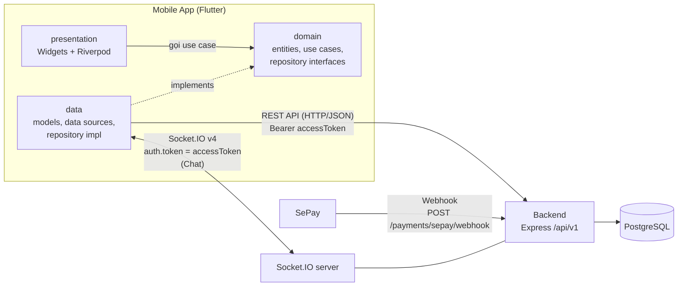
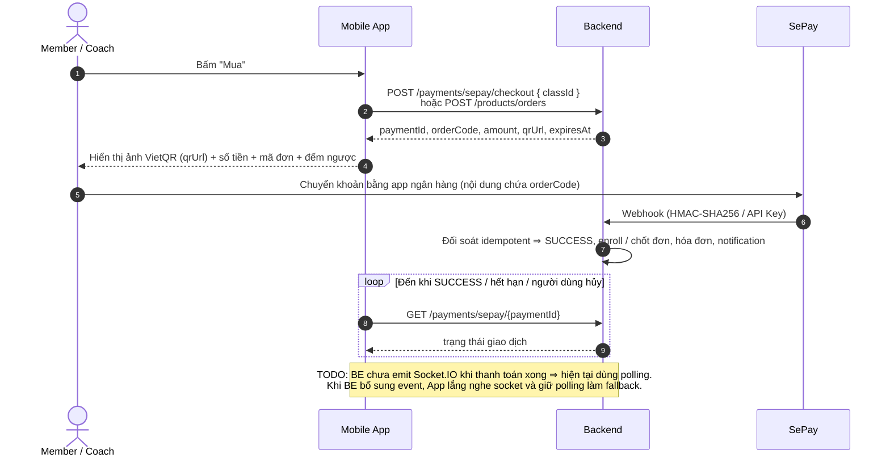

# Sports Center Management System - Mobile

Ứng dụng Mobile (Flutter, Android & iOS) cho hệ thống quản lý trung tâm thể thao: khóa học & lịch tập, điểm danh QR, thanh toán SePay (VietQR), cửa hàng sản phẩm, hoàn tiền, ví HLV, chat, thông báo. Dùng chung Backend với Web qua REST API (`/api/v1`) và Socket.IO.

> **Trạng thái:** project vừa khởi tạo bằng `flutter create` (package `sports_center_mobile`, applicationId `prm.sportscenter.sports_center_mobile`). `lib/` mới chỉ có `main.dart` mẫu; các package ở mục [Công nghệ](#-công-nghệ-sử-dụng-mobile-frontend) là stack **đã chọn**, **chưa** được thêm vào `pubspec.yaml`.
>
> **Dành cho AI agent / dev mới:** nguồn sự thật về API là Swagger của BE (`http://localhost:<PORT>/api/v1/docs`) và [`BE/README.md`](../BE/README.md). Không gọi endpoint/field không có trong Swagger. Nếu README này lệch với BE thì **BE thắng** — sửa README trong cùng thay đổi. Endpoint trong README này ghi **không kèm** prefix `/api/v1` (giống Swagger).

## 📱 Giới thiệu

- **Vai trò trong hệ thống:** client thứ hai (bên cạnh Web Frontend `FE/`) của cùng một Backend (`BE/`). App **không chứa nghiệp vụ tiền/quyền**: chia doanh thu 85/15, auto-enroll, giữ/hoàn kho, tính tiền hoàn, điều kiện rút tiền… đều do BE quyết định; App chỉ hiển thị dữ liệu và gửi thao tác của người dùng.
- **Đối tượng sử dụng:**
  - **Member (Học viên)** — người dùng chính: mua khóa học, xem lịch, điểm danh, mua sản phẩm, chat với HLV.
  - **Coach (Huấn luyện viên)** — đăng ký + nộp CV, dạy & điểm danh, quản lý ví, chat với học viên.
  - **Guest** — khám phá sản phẩm và đăng ký tài khoản.
  - **Manager** — quản trị trên Web (xem mục Manager bên dưới).

## ✨ Tính năng chính

Chỉ liệt kê tính năng có trong [`Doc/PROJECT_OVERVIEW.md`](../Doc/PROJECT_OVERVIEW.md) / BE. Mọi route mặc định cần Bearer token trừ khi ghi "công khai".

### Guest

- Xem danh sách / chi tiết sản phẩm — công khai (`GET /products`, `GET /products/:id`).
- Đăng ký tài khoản Member hoặc Coach (`POST /auth/register`).
- `TODO:` PROJECT_OVERVIEW nói Guest được xem khóa học, nhưng `GET /classes` ở BE hiện bắt buộc `authenticate` ⇒ cần BE mở route công khai hoặc App chỉ hiện khóa học sau khi đăng nhập.

### Member

- **Tài khoản:** đăng nhập/đăng xuất, quên & đặt lại mật khẩu, xem/sửa hồ sơ, đổi avatar (`/auth/login`, `/auth/logout`, `/auth/forgot-password`, `/auth/reset-password`, `/auth/me`, `POST /auth/me/avatar`).
- **Khóa học:** xem danh sách/chi tiết khóa học và lộ trình khóa (`GET /classes`, `GET /classes/:id`, `GET /classes/:id/course-plan`).
- **Mua khóa học bằng VietQR:** tạo giao dịch (`POST /payments/sepay/checkout` với `classId`), hiển thị QR, chờ BE xác nhận (xem [luồng thanh toán](#luồng-thanh-toán-sepay--vietqr)). Thành công ⇒ BE tự enroll vào mọi buổi SCHEDULED chưa diễn ra.
- **Lịch tập:** xem các buổi đã đặt và quota (`GET /enrollments/my`, `GET /enrollments/my/quota`), hủy / đổi buổi (`DELETE /enrollments/:id`, `POST /enrollments/:id/transfer`).
- **Điểm danh:** quét QR do HLV mở bằng camera (`POST /attendance/scan-qr`), có mã dự phòng nhập tay khi camera hỏng; xem lịch sử & tổng kết chuyên cần (`GET /attendance/my`, `GET /attendance/my/summary`).
- **Tập luyện:** xem Training Plan và kết quả HLV ghi nhận (`GET /training-plans`).
- **Đánh giá HLV:** chấm 1–5 sao + bình luận cho HLV đã/đang học cùng (`POST /feedbacks`, `GET /feedbacks/my`, `DELETE /feedbacks/:id`).
  `TODO:` PROJECT_OVERVIEW mô tả "Coach gửi feedback cho Member", còn code BE là Member đánh giá Coach — README theo code, cần xác nhận lại tài liệu.
- **Cửa hàng:** tạo đơn sản phẩm (`POST /products/orders`, BE giữ kho + trả QR), hủy đơn PENDING (`POST /products/orders/:id/cancel`), xem đơn của tôi (`GET /products/my/orders`), đánh giá sản phẩm đã mua thành công (`POST /products/:id/reviews`).
- **Hủy khóa & hoàn tiền:** gửi yêu cầu khi còn ≥ 24 giờ trước buổi khai giảng (`POST /refunds/course-cancellation`), theo dõi trạng thái (`GET /refunds/my`).
- **Hóa đơn:** xem hóa đơn của mình (`GET /invoices/member/:memberId`, `GET /invoices/:id`).
- **Chat** với HLV (text real-time + ảnh/file) và **Thông báo** — xem mục [Kiến trúc](#-kiến-trúc--luồng-giao-tiếp-với-backend).

### Coach

- **Onboarding:** đăng ký với role `COACH` ⇒ BE trả `accessToken` tạm + `requireCvUpload: true` (tài khoản còn `isActive = false`) ⇒ App dùng token đó nộp CV PDF (`POST /coaches/me/cv`, field `cv`, ≤ 10MB) ⇒ chờ Manager duyệt mới đăng nhập bình thường được.
- **Lớp & lịch dạy:** xem lớp và các buổi (`GET /classes`, `GET /class-schedules`, `GET /class-schedules/:id`); đánh dấu buổi đã dạy xong (`PATCH /class-schedules/:id/complete`).
- **Hủy buổi học:** buổi chưa có ai đặt ⇒ hủy thẳng; đã có học viên ⇒ bắt buộc chọn `resolution` = `MAKEUP` (dạy bù) hoặc `REFUND` (`POST /class-schedules/:id/cancel`).
- **Điểm danh:** mở QR cho buổi học để Member quét (`POST /attendance/generate-qr`), điểm danh / sửa thủ công (`POST /attendance`, `PATCH /attendance/:id`).
- **Training Plan:** tạo/sửa lộ trình cho từng Member và ghi kết quả (`POST /training-plans`, `PATCH /training-plans/:id`, `POST /training-plans/results`).
- **Đánh giá nhận được:** xem feedback của Member (`GET /feedbacks`).
- **Ví ảo:** xem số dư & lịch sử (`GET /coaches/me/wallet`, `GET /coaches/me/wallet/transactions`), tạo lệnh rút tiền (`POST /coaches/me/wallet/withdraw`) — chỉ khi **mọi** buổi của khóa đã `COMPLETED`; số dư khả dụng đã trừ tiền hoàn đang chờ duyệt.
- **Cửa hàng:** Coach cũng được mua sản phẩm như Member.
- **Chat** với học viên và **Thông báo**.
- `TODO:` tạo/sửa khóa học và lịch (`POST /classes`, `POST /class-schedules`, `POST /class-schedules/activity-plan`) — form phức tạp (phòng, môn, kiểm tra trùng lịch): xác nhận làm trên Mobile hay chỉ trên Web.

### Manager

- Quản trị (phòng, môn, sản phẩm & tồn kho, duyệt CV, duyệt rút tiền, duyệt/từ chối hoàn tiền, báo cáo) thực hiện trên **Web**, ngoài phạm vi Mobile giai đoạn đầu.
- `TODO:` xác nhận có cần bản Manager rút gọn trên Mobile (VD: nhận thông báo + duyệt CV/rút tiền/hoàn tiền) hay không.

## 🚀 Công nghệ sử dụng (Mobile Frontend)

| Hạng mục | Lựa chọn | Ghi chú |
|---|---|---|
| **Framework** | Flutter (Dart), Android & iOS | Project tạo bằng Flutter 3.47.3 (stable) / Dart 3.13.3; `pubspec.yaml` yêu cầu Dart `^3.13.3`. |
| **Architecture** | Feature-first + Clean Architecture (`presentation` / `domain` / `data`) | Mỗi feature tương ứng một (hoặc vài) module của BE — xem [Cấu trúc thư mục](#-cấu-trúc-thư-mục-dự-kiến). |
| **State Management & DI** | Riverpod | Provider cho Dio, SocketService, repository; Notifier cho state màn hình. |
| **Networking** | Dio | Interceptor gắn JWT, refresh token, xử lý lỗi tập trung (chi tiết bên dưới). |
| **Data Model** | `freezed` + `json_serializable` | Sinh code bằng `build_runner`. |
| **Real-time** | `socket_io_client` | Tương thích Socket.IO v4 ở BE (`socket.io ^4.8`). Hiện BE chỉ dùng socket cho **Chat**. |
| **Thanh toán** | Hiển thị VietQR do BE/SePay sinh | Webhook SePay gọi thẳng BE, **không** qua App. |
| **Upload / hiển thị ảnh** | `image_picker` + multipart qua Dio; `cached_network_image` | Gửi tới các endpoint Multer của BE. |
| **Local Storage** | `flutter_secure_storage` (token); `shared_preferences` / Hive (cache) | Token **chỉ** lưu ở secure storage. |
| **Navigation** | `go_router` | `redirect` theo trạng thái đăng nhập + role (Member/Coach, Coach chưa duyệt). |
| **Cấu hình môi trường** | `--dart-define` | Xem mục **Cài đặt & chạy** bên dưới. |
| **Push Notification (FCM)** | `TODO` / tùy chọn | BE **chưa** tích hợp FCM (không có device token, không gửi push). |

### Networking (Dio)

- **Response chuẩn của BE** (`BE/src/utils/response.ts`): `{ success, message, data?, pagination?, errors? }`; `pagination = { page, limit, total, totalPages }`. Lỗi validate trả `400` với `errors: [{ field, message }]` ⇒ map thẳng vào lỗi của từng ô trong form.
- **Auth interceptor:** gắn `Authorization: Bearer <accessToken>` cho mọi request (trừ route công khai).
- **Refresh token:** gặp `401` ⇒ gọi `POST /auth/refresh-token` với body `{ "refreshToken": "..." }` **một lần** (khóa lại để nhiều request song song không cùng refresh), lưu cặp token mới rồi retry request gốc; refresh thất bại ⇒ xóa token, về màn đăng nhập.
- **Error interceptor:** chuyển `DioException` + body lỗi của BE thành `Failure` thống nhất (mạng, `400`, `401`, `403`, `404`, `409`, `500`); UI chỉ đọc `message`.

### Real-time (Socket.IO)

- Kết nối tới **origin** của BE (namespace mặc định), truyền token ở handshake: `auth: { token: <accessToken> }` (BE cũng chấp nhận header `Authorization: Bearer`).
- BE **chỉ xác thực lúc handshake** ⇒ sau khi refresh token phải **ngắt và kết nối lại** với token mới. BE chủ động ngắt socket khi tài khoản bị khóa / đổi role / đổi mật khẩu ⇒ App coi đó là phiên hết hạn.
- **Sự kiện Chat** (theo `BE/src/modules/chat/chat.socket.ts`):

  | Chiều | Event | Payload |
  |---|---|---|
  | App → BE | `sendMessage` | `{ receiverId, content }` + ack |
  | App → BE | `typing` | `{ receiverId, isTyping }` |
  | App → BE | `markAsRead` | `{ targetId }` + ack |
  | App → BE | `presence:list` | ack trả danh sách `userId` đang online |
  | BE → App | `newMessage`, `messageSent` | tin nhắn |
  | BE → App | `typing` | `{ userId, isTyping }` |
  | BE → App | `messagesRead` | thông tin đã đọc |
  | BE → App | `presenceChanged` | `{ userId, online }` |

- Tin nhắn **kèm file/ảnh** gửi qua REST: `POST /chat/messages` (multipart, field `file`, ≤ 10MB). File chat là **riêng tư**: tải qua `GET /chat/attachments/:id` có xác thực ⇒ khi hiển thị bằng `cached_network_image` phải truyền header `Authorization`.
- REST còn lại của chat: `GET /chat/contacts`, `GET /chat/conversations`, `GET /chat/messages`, `PATCH /chat/messages/read`, `GET /chat/messages/unread-count`.

### Notification

- Hiện BE lưu notification vào DB (qua outbox) và cung cấp REST: `GET /notifications`, `GET /notifications/unread-count`, `PATCH /notifications/:id/read`, `PATCH /notifications/mark-all-read`.
- `TODO:` PROJECT_OVERVIEW mô tả notification "thời gian thực", nhưng BE **chưa emit** sự kiện Socket.IO nào cho notification ⇒ trước mắt App tải lại khi mở màn hình / app quay lại foreground (và có thể polling `unread-count`). Khi BE bổ sung event, App chuyển sang lắng nghe socket.

### Upload file

| Mục đích | Endpoint | Field | Giới hạn |
|---|---|---|---|
| Avatar | `POST /auth/me/avatar` | `avatar` | ảnh, 5MB (BE kiểm chữ ký file thật) |
| File chat | `POST /chat/messages` | `file` | 10MB |
| CV Coach | `POST /coaches/me/cv` | `cv` | PDF, 10MB |

- Avatar trả về là URL Cloudinary hoặc đường dẫn local `/uploads/avatars/...` (công khai) ⇒ ghép với origin BE khi là đường dẫn tương đối.
- `TODO:` `image_picker` không chọn được PDF ⇒ cần thêm package chọn file (VD `file_picker`) cho luồng nộp CV.

## 🧭 Kiến trúc & luồng giao tiếp với Backend



### Luồng thanh toán (SePay / VietQR)

Dùng chung cho mua khóa học và đơn sản phẩm:



- App **không** nhận webhook và **không** tự quyết định "đã thanh toán" — chỉ tin trạng thái BE trả về.
- Khi BE có `SEPAY_API_TOKEN`, mỗi lần App polling `GET /payments/sepay/{id}` BE còn chủ động đối soát qua SePay API (không cần webhook) — xem [`BE/README.md`](../BE/README.md) mục SePay.
- Đơn sản phẩm quá hạn chờ chuyển khoản ⇒ BE tự `CANCELLED` + hoàn kho; App hiển thị theo trạng thái trả về.

## 📦 Cấu trúc thư mục dự kiến

```
lib/
├── main.dart                         # Entry: ProviderScope + App
├── app/
│   ├── app.dart                      # MaterialApp.router, theme
│   └── router.dart                   # go_router: routes + redirect theo đăng nhập/role
├── core/
│   ├── config/env.dart               # Đọc --dart-define (API_BASE_URL, ...)
│   ├── network/                      # Dio client, interceptors (auth, refresh, error), ApiResponse<T>
│   ├── socket/                       # SocketService (socket_io_client), reconnect khi đổi token
│   ├── storage/                      # Secure storage (token), cache (shared_preferences / Hive)
│   ├── error/                        # Failure / AppException, map lỗi BE
│   ├── utils/                        # Format tiền VND, ngày giờ Asia/Ho_Chi_Minh, validators
│   └── widgets/                      # Widget dùng chung (loading, empty, error, VietQR view, ...)
└── features/
    └── <feature>/
        ├── data/
        │   ├── datasources/          # <feature>_remote_data_source.dart (Dio / Socket)
        │   ├── models/               # <name>_model.dart (freezed + json_serializable)
        │   └── repositories/         # <feature>_repository_impl.dart
        ├── domain/
        │   ├── entities/
        │   ├── repositories/         # <feature>_repository.dart (abstract)
        │   └── usecases/
        └── presentation/
            ├── providers/            # Riverpod providers / Notifier
            ├── screens/              # <name>_screen.dart
            └── widgets/
```

Feature ↔ module BE:

| Feature (`lib/features/`) | Module BE | Nội dung |
|---|---|---|
| `auth` | `auth` | Đăng ký/đăng nhập, refresh, quên mật khẩu, hồ sơ, avatar |
| `classes` | `classes`, `class-schedules` (+ `sports`, `rooms` để hiển thị) | Khóa học, buổi học, hủy buổi / dạy bù |
| `enrollments` | `enrollments` | Lịch đã đặt, quota, hủy / đổi buổi |
| `payments` | `payments`, `invoices` | Checkout VietQR, polling trạng thái, hóa đơn |
| `products` | `products` | Cửa hàng, đơn hàng, đánh giá sản phẩm |
| `refunds` | `refunds` | Yêu cầu hủy khóa & theo dõi hoàn tiền |
| `attendance` | `attendance` | Quét / mở QR, mã dự phòng, tổng kết chuyên cần |
| `training_plans` | `training-plans` | Lộ trình & kết quả tập luyện |
| `feedbacks` | `feedbacks` | Đánh giá HLV |
| `coach` | `coaches` (gồm `coach-wallet`) | Nộp CV, ví ảo, rút tiền |
| `chat` | `chat` | REST + Socket.IO |
| `notifications` | `notifications` | Danh sách, unread count, đánh dấu đã đọc |

## 🧰 Yêu cầu môi trường

- **Flutter SDK** kênh stable (project tạo bằng Flutter 3.47.3 / Dart 3.13.3).
- **Android Studio** (Android SDK + Emulator, plugin Flutter & Dart) — hoặc VS Code + extension Flutter.
- **Xcode** (chỉ trên macOS) để chạy/build iOS.
- **Backend đang chạy** — xem [`BE/README.md`](../BE/README.md) (mặc định cổng `8080` nếu không đặt `PORT`).
- Chạy `flutter doctor` và xử lý hết lỗi của nền tảng định build trước khi bắt đầu:
  ```bash
  flutter doctor
  ```

## 🛠️ Cài đặt & chạy

1. **Cài dependencies:**
   ```bash
   cd Mobile
   flutter pub get
   ```
2. **Sinh code** (sau khi đã thêm `freezed` / `json_serializable`, và mỗi lần sửa model):
   ```bash
   dart run build_runner build --delete-conflicting-outputs
   ```
3. **Chạy app với `--dart-define`:**

   `API_BASE_URL` là **origin** của BE (không kèm `/api/v1`): App tự ghép `/api/v1` cho REST, còn Socket.IO và ảnh `/uploads/avatars/...` dùng chung origin này.
   ```bash
   # Android Emulator — BE chạy ở localhost:8080 trên máy dev
   flutter run --dart-define=API_BASE_URL=http://10.0.2.2:8080

   # iOS Simulator
   flutter run --dart-define=API_BASE_URL=http://localhost:8080

   # Thiết bị thật — cùng mạng Wi-Fi với máy chạy BE (dùng IP LAN của máy)
   flutter run --dart-define=API_BASE_URL=http://192.168.1.10:8080
   ```
   Hoặc gom biến vào file: `flutter run --dart-define-from-file=env/dev.json` với `{ "API_BASE_URL": "http://10.0.2.2:8080" }`.

**Lưu ý:**

- **Android Emulator** không hiểu `localhost` của máy dev (đó là chính emulator) ⇒ dùng `10.0.2.2` để trỏ về máy host.
- **HTTP (không TLS):** Android 9+ chặn cleartext HTTP mặc định ⇒ khi dev với BE chạy `http://`, cho phép cleartext ở bản debug (`android:usesCleartextTraffic="true"` trong `android/app/src/debug/AndroidManifest.xml` hoặc network security config). iOS gặp lỗi ATS thì cấu hình `NSAppTransportSecurity` trong `ios/Runner/Info.plist` cho môi trường dev.
- **Build release Android:** template Flutter chỉ khai báo quyền `INTERNET` ở manifest `debug`/`profile` ⇒ phải thêm `<uses-permission android:name="android.permission.INTERNET"/>` vào `android/app/src/main/AndroidManifest.xml` trước khi build release.
- **Quyền camera / thư viện ảnh:** quét QR và `image_picker` cần khai báo quyền (Android) và `NSCameraUsageDescription` / `NSPhotoLibraryUsageDescription` (iOS). `TODO:` chọn package quét QR (VD `mobile_scanner`).
- **`--dart-define` được nhúng vào file build** ⇒ **không** đặt secret (JWT secret, SePay key…) vào đây; App không cần secret nào của BE.
- **Thanh toán khi BE chạy localhost:** SePay không gọi được webhook về máy dev ⇒ dùng `SEPAY_MOCK_MODE=true` ở BE và xác nhận bằng `POST /payments/sepay/mock-confirm`, hoặc đặt `SEPAY_API_TOKEN` để BE tự đối soát khi App polling. Chi tiết ở [`BE/README.md`](../BE/README.md).
- **Kiểm tra:**
  ```bash
  flutter analyze
  flutter test
  ```

## 📐 Quy ước code

- **Đặt tên (Effective Dart):** file & thư mục `snake_case` (`class_detail_screen.dart`, `training_plans/`); class/enum/typedef `PascalCase`; biến, hàm, hằng số `lowerCamelCase`. Hậu tố file theo vai trò: `_screen`, `_widget`, `_provider`, `_notifier`, `_model`, `_entity`, `_repository`, `_repository_impl`, `_remote_data_source`, `_usecase`.
- **Phụ thuộc giữa các tầng:** `presentation → domain ← data`. `domain` thuần Dart (không import Flutter/Dio); feature này không import trực tiếp `data/` của feature khác.
- **Model khớp JSON của BE:** giữ tên field `camelCase` như BE trả về; không sửa tay file sinh (`*.g.dart`, `*.freezed.dart`).
  - Tiền: BE lưu `Decimal(12,2)` — `TODO:` xác nhận kiểu JSON thực tế trên Swagger (Prisma thường serialize `Decimal` thành chuỗi); không tính toán tiền bằng `double`.
  - Thời gian: BE lưu UTC ⇒ App hiển thị theo `Asia/Ho_Chi_Minh`.
- **Bảo mật:** token chỉ ở `flutter_secure_storage`; không log token / dữ liệu cá nhân.
- **Git:**
  - Nhánh tách từ `develop`: `feature/mobile-<tên-ngắn>`, `fix/mobile-<tên-ngắn>`; PR vào `develop`.
  - Commit theo kiểu đang dùng trong repo: `feat(Mobile): ...`, `fix(Mobile): ...`, `docs(Mobile): ...`.
- **Trước khi báo xong:** `dart format .`, `flutter analyze` không có cảnh báo mới, `flutter test` pass; cập nhật README nếu đổi cấu hình, quy ước hoặc luồng gọi API.
