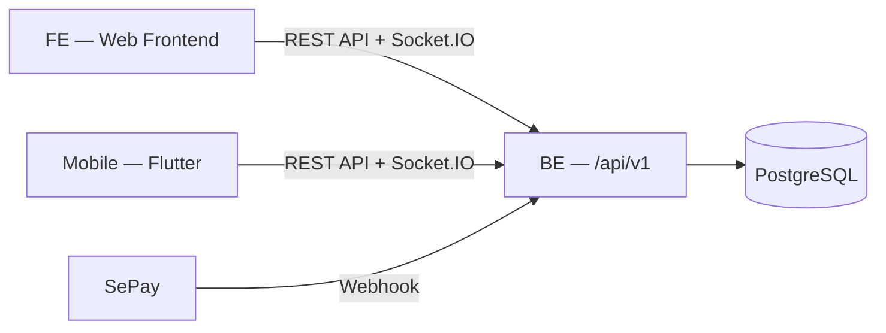

# Sports-Center-Management-System

Hệ thống quản lý trung tâm thể thao theo mô hình nền tảng kết nối: Huấn luyện viên (Coach) tự mở khóa học và định giá, Học viên (Member) mua khóa học / sản phẩm bằng chuyển khoản VietQR (SePay), Quản lý (Manager) vận hành phòng tập, duyệt Coach, duyệt rút tiền và hoàn tiền.

Backend cung cấp REST API (HTTP/JSON) và Socket.IO, dùng chung cho **Web Frontend** và **Mobile App (Flutter)**. Mô tả nghiệp vụ chi tiết: [`Doc/PROJECT_OVERVIEW.md`](Doc/PROJECT_OVERVIEW.md).

## 📦 Cấu trúc repo

```
.
├── BE/       # Backend — Node.js (Express 5, TypeScript), Prisma + PostgreSQL, Socket.IO, SePay   → BE/README.md
├── FE/       # Web Frontend
├── Mobile/   # Mobile App — Flutter (Android & iOS), package `sports_center_mobile`               → Mobile/README.md
└── Doc/      # Tài liệu dự án (PROJECT_OVERVIEW.md)
```



## 📱 Mobile App

App Flutter (Android & iOS) dành cho Member và Coach: khóa học & lịch tập, điểm danh QR, thanh toán VietQR, cửa hàng, hoàn tiền, ví HLV, chat và thông báo. Dùng Feature-first + Clean Architecture, Riverpod, Dio, `socket_io_client`, `go_router`. Xem cách cài đặt, kiến trúc và quy ước tại [`Mobile/README.md`](Mobile/README.md).
